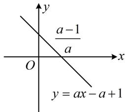
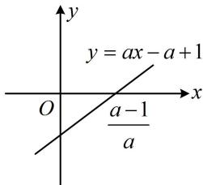

> [!faq]- 《第3节 分析带参函数的单调区间、极值、最值》例题解析
>
> > [!success]- **【答案】** 详见解析
>
> > [!note]- **【分析】**
> > 本题未单列分析。
>
> > [!note]- **【解析】**
> > 解：由题意， $f'(x)=a-\frac{a-1}{x}=\frac{ax-a+1}{x}$ ，x>0，（由 $f'(x)=0$ 可得 $x=\frac{a-1}{a}$ ，若导函数在定义域内有零点，则 $\frac{a-1}{a}>0$ ，故a<0或a>1，余下即为 $f'(x)$ 在定义域内没有零点的情形，讨论的标准就有了）
> > - **①**：当 $a < 0$ 时，直线 $y = ax - a + 1$ 如图1，由图可知 $f'(x) > 0 \Leftrightarrow 0 < x < \frac{a - 1}{a}$ ， $f'(x) < 0 \Leftrightarrow x > \frac{a - 1}{a}$ ，
> >
> > 所以 $f(x)$ 在 $\left(0, \frac{a - 1}{a}\right)$ 上单调递增，在 $\left(\frac{a - 1}{a}, +\infty\right)$ 上单调递减；
> > - **②**：当 $a > 1$ 时，直线 $y = ax - a + 1$ 如图2，由图可知 $f^{\prime}(x) < 0 \Leftrightarrow 0 < x < \frac{a - 1}{a}$ ， $f^{\prime}(x) > 0 \Leftrightarrow x > \frac{a - 1}{a}$ ，
> >
> > 所以 $f(x)$ 在 $\left(0, \frac{a-1}{a}\right)$ 上单调递减，在 $\left(\frac{a-1}{a}, +\infty\right)$ 上单调递增；
> > （余下的部分就是 $f'(x)$ 在定义域上无零点的情形，此时 $f'(x)$ 必定不变号）
> > - **③**：当 $0 \leq a \leq 1$ 时， $ax \geq 0$ ， $-a + 1 \geq 0$ ，所以 $ax - a + 1 \geq 0$ ，从而 $f'(x) \geq 0$ ，故 $f(x)$ 在 $(0, +\infty)$ 上单调递增.
> >
> > 
> >
> >   
> > 图1  
> > 图2
>
> > [!tip]- **【总结】**
> > 从例 1 和上面的几个变式可以看出, 当 $f'(x)$ 最多 1 个零
> >
> > 点时，寻找讨论依据的方法是先令 $f'(x) = 0$ ，求出 $x$ ，再看它何时在定义域内，何时不在定义域内.
