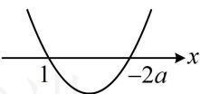
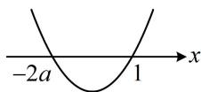

> [!faq]- 《第3节 分析带参函数的单调区间、极值、最值》例题解析
>
> > [!success]- **【答案】** 详见解析
>
> > [!note]- **【分析】**
> > 本题未单列分析。
>
> > [!note]- **【解析】**
> > 解：由题意， $f'(x)=x^{2}+(2a-1)x-2a=(x+2a)(x-1)$ ，
> >
> > (观察发现 $f'(x)$ 有 $-2a$ 和 1 两个零点, 但这两个零点的大小不定, 所以讨论的依据是零点的大小) ①当 $a < -\frac{1}{2}$ 时, $-2a > 1$ , $f'(x)$ 的草图如图 1, $f'(x) > 0 \Leftrightarrow x < 1$ 或 $x > -2a$ , $f'(x) < 0 \Leftrightarrow 1 < x < -2a$ , 所以 $f(x)$ 在 $(- \infty, 1)$ 上单调递增, 在 $(1, -2a)$ 上单调递减, 在 $(-2a, + \infty)$ 上单调递增;
> > - **②**：当 $a = -\frac{1}{2}$ 时， $f'(x) = (x - 1)^2 \geq 0$ ，所以 $f(x)$ 在 $\mathbf{R}$ 上单调递增；
> > - **③**：当 $a > -\frac{1}{2}$ 时， $-2a < 1$ ， $f^{\prime}(x)$ 的草图如图2，
> >
> > 
> >
> >   
> > 图1  
> > 图2
> >
> > $f^{\prime}(x) > 0\Leftrightarrow x <   - 2a$ 或 $x > 1$ ， $f^{\prime}(x) <   0\Leftrightarrow -2a <   x <   1$
> >
> > 所以 $f(x)$ 在 $(- \infty, -2a)$ 上单调递增，在 $(-2a, 1)$ 上单调递减，在 $(1, +\infty)$ 上单调递增.
