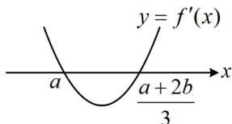
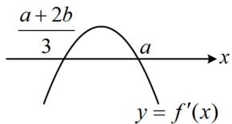
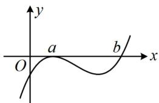
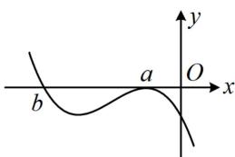

> [!faq]- 《第3节 分析带参函数的单调区间、极值、最值》例题解析
>
> > [!success]- **【答案】** D
>
> > [!note]- **【分析】**
> > 本题未单列分析。
>
> > [!note]- **【解析】**
> > 解法1: 题干涉及极值点, 可从 $f'(x)$ 的角度出发分析极值的情况, 下面先求导,
> >
> > 由题意， $f'(x) = a[2(x - a)(x - b) + (x - a)^2] = a(x - a)(3x - a - 2b)$ ， $f'(x) = 0 \Rightarrow x = a$ 或 $\frac{a + 2b}{3}$ ，因为 $f(x)$ 有极值, 所以必有 $a \neq \frac{a + 2b}{3}$ , $a$ 的正负影响二次函数开口, 故要判断导函数的正负, 得先讨论 $a$ 的正负, 再由 $x = a$ 是极大值点来判断 $a$ 和 $\frac{a + 2b}{3}$ 的大小, 当 $a > 0$ 时, 因为 $x = a$ 是 $f(x)$ 的极大值点, 所以 $f'(x)$ 在 $x = a$ 附近应为左正右负, 故 $f'(x)$ 的图象如图1, 由图可知 $a < \frac{a + 2b}{3}$ , 故 $a < b$ , 两端同乘以 $a$ 可得 $a^2 < ab$ ; 当 $a < 0$ 时, 因为 $x = a$ 是 $f(x)$ 的极大值点, 所以 $f'(x)$ 在 $x = a$ 附近应为左正右负, 故 $f'(x)$ 的图象如图2, 由图可知 $a > \frac{a + 2b}{3}$ , 故 $a > b$ , 两端同乘以 $a$ 可得 $a^2 < ab$ ; 故选D.
> >
> > 解法2: 注意到 $f(x)$ 有 $a$ 和 $b$ 两个零点, 而 $x = a$ 也是 $f(x)$ 的极大值点, 这些都是 $f(x)$ 图象上的关键特征,据此已经能把 $f(x)$ 的大致图象画出来了, 所以本题也可直接从 $f(x)$ 的图象出发考虑, $a$ 的正负不同会导致图象的整体趋势不同, 故讨论 $a$ 的正负,
> >
> > 当 $a > 0$ 时， $f(x) = 0 \Rightarrow x = a$ 或 $b$ ，要使 $x = a$ 是 $f(x)$ 的极大值点，则 $f(x)$ 的大致图象如图3，
> >
> > $$
> > a <   b
> > $$
> >
> > $$
> > a ^ {2} <   a b
> > $$
> >
> > 当 $a < 0$ 时， $f(x) = 0 \Rightarrow x = a$ 或 $b$ ，要使 $x = a$ 是 $f(x)$ 的极大值点，则 $f(x)$ 的大致图象如图4，
> >
> > 由图可知 $a > b$ ，两端同乘以 $a$ 可得 $a^2 < ab$ ；故选D.
> >
> >
> >   
> > 图1
> >
> >   
> > 图2
> >
> >   
> > 图3
> >
> >   
> > 图4
>
> > [!tip]- **【反思】**
> > 数形结合是一种重要的思想方法，零点和极值点是三次函数图象上的关键信息，若能从题干分析出这些信息，往往可以结合图象来简化计算过程.
