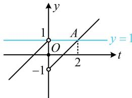
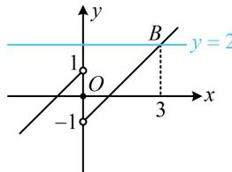

> [!faq]- 《第1节 分段函数基础题型》参考答案
>
> > [!success]- **【答案】** 3
>
> > [!note]- **【分析】**
> > 本题未单列分析。
>
> > [!note]- **【解析】**
> > 解析：看到复合结构的方程，先将内层的 $f(x)$ 换元成 $t$ ，化整为零，令 $t = f(x)$ ，则 $f(f(x)) = 1$ 即为 $f(t) = 1$
> >
> > 因为 $f(x)$ 的解析式较为简单，容易画图，所以可画图象来解方程 $f(t) = 1$ ，
> >
> > 函数 $y = f(t)$ 的图象如图1，直线 $y = 1$ 与该图象只有1个横坐标为2的交点 $A$ ，所以 $t = 2$ ，故 $f(x) = 2$ ，函数 $y = f(x)$ 的图象如图2，直线 $y = 2$ 与该图象只有1个横坐标为3的交点 $B$ ，所以 $x = 3$ .
> >
> >   
> > 图1
> >
> >   
> > 图2
