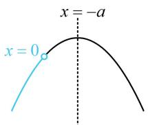
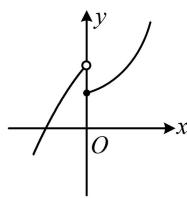
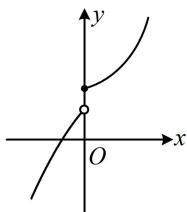
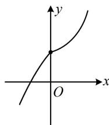

> [!faq]- 《第1节 分段函数基础题型》参考答案
>
> > [!success]- **【答案】** C
>
> > [!note]- **【分析】**
> > 本题未单列分析。
>
> > [!note]- **【解析】**
> > 解析：分段函数在 R 上 ↗，先考虑各段上分别 ↗，
> > 当 x < 0 时， $f(x) = -x^{2} - 2ax - a$ ，如图 1，
> > 要使 $f(x)$ 在 $(-\infty, 0)$ 上 ↗，应有 $-a \geq 0$ ，所以 $a \leq 0$ ①，
> > 当 $x \geq 0$ 时，因为 $y = e^{x}$ 和 $y = \ln(x + 1)$ 都 ↗，
> > 所以 $f(x)=e^{x}+\ln(x+1)$ 也 ↗，
> > 结束了吗？没有，还需考虑分段点处的拼接情况，图2的情形不满足 $f(x)$ 在R上↗，图3或图4满足，
> > 要使 $f(x)$ 在 R 上 ↗，应有 $-0^{2}-2a\cdot0-a\leq e^{0}+\ln(0+1)$ 解得： $a \geq -1$ ，结合①得 a 的取值范围是 [-1,0].
> >
> >   
> > 图1
> >
> > 
> >
> >   
> > 图3
> >
> > 图2  
> >   
> > 图4
