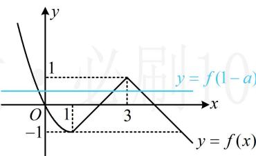
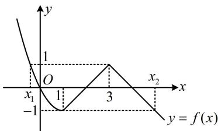

> [!faq]- 《第1节 分段函数基础题型》参考答案
>
> > [!success]- **【答案】** D
>
> > [!note]- **【分析】**
> > 本题未单列分析。
>
> > [!note]- **【解析】**
> > D
> >
> > 解析： $f(x) - f(1 - a) = 0\Leftrightarrow f(x) = f(1 - a),$
> >
> > 此式右边与 $x$ 无关，可将其整体看成常数，则题设条件 $\Leftrightarrow$ 水平直线 $y = f(1 - a)$ 与 $f(x)$ 的图象至少有2个交点，故考虑画出 $f(x)$ 的图象来分析．为了方便画图，我们先去掉 $x > 1$ 那段解析式的绝对值，
> >
> > 当 $1 < x < 3$ 时， $x - 3 < 0$ ， $f(x) = 1 - (3 - x) = x - 2$ ，当 $x \geq 3$ 时， $x - 3 \geq 0$ ， $f(x) = 1 - (x - 3) = -x + 4$ ，所以 $f(x) = \begin{cases} x^2 - 2x, & x \leq 1 \\ x - 2, & 1 < x < 3 \\ -x + 4, & x \geq 3 \end{cases}$
> >
> > 故函数 $f(x)$ 的大致图象如图 1 所示，
> >
> >   
> > 图1
> >
> > 注意到 $f(1) = -1$ ， $f(3) = 1$ ，故要使直线 $y = f(1 - a)$ 与 $f(x)$ 的图象至少有2个交点，则 $-1\leq f(1 - a)\leq 1$ ①，怎样解上述不等式？已有 $f(x)$ 的图象，可直接结合图象来看，如图2，要使不等式①成立，应有 $x_{1}\leq 1 - a\leq x_{2}$ ，下面求 $x_{1}$ 和 $x_{2}$ ，令 $x^{2} - 2x = 1$ 得 $x = 1\pm \sqrt{2}$ ，由图2可知 $x_{1} <   0$ ，所以 $x_{1} = 1 - \sqrt{2}$ ，令 $-x + 4 = -1$ 得 $x = 5$ ，所以 $x_{2} = 5$ 故 $1 - \sqrt{2}\leq 1 - a\leq 5$ ，解得： $-4\leq a\leq \sqrt{2}$
> >
> >   
> > 图2
