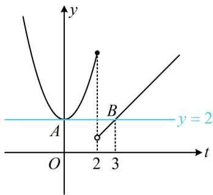
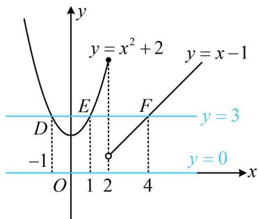

> [!faq]- 《第1节 分段函数基础题型》例题解析
>
> > [!success]- **【答案】** 4 或 $\pm 1$
>
> > [!note]- **【分析】**
> > 本题未单列分析。
>
> > [!note]- **【解析】**
> > 解析：看到复合结构的方程，常考虑将内层的 $f(x)$ 换元，化整为零，
> >
> > 令 $t = f(x)$ ，则 $f(f(x)) = 2$ 即为 $f(t) = 2$
> >
> > 下面先由此解 $t$ ，因为 $f(x)$ 的解析式较为简单，容易画图，所以可结合图象来解方程 $f(t) = 2$
> >
> > 函数 $y = f(t)$ 的图象如图1，由图可知直线 $y = 2$ 与该图象有 $A, B$ 两个交点，横坐标分别为0和3，所以方程 $f(t) = 2$ 的解为 $t = 0$ 或3，故 $f(x) = 0$ 或 $f(x) = 3$ ，
> >
> > 接下来又可通过观察直线 $y = 0$ 和 $y = 3$ 与 $f(x)$ 图象的交点, 来解这两个方程,
> >
> > 如图2，直线 $y = 0$ 与 $y = f(x)$ 的图象没有交点，直线 $y = 3$ 与 $y = f(x)$ 的图象有 $D$ ， $E$ ， $F$ 三个交点，
> >
> > 它们的横坐标分别为-1，1，4，所以 $x = \pm 1$ 或4.
> >
> >
> >   
> > 图1
> >
> >   
> > 图2
>
> > [!tip]- **【反思】**
> > 对于 $f(f(a))$ 这种复合结构，常先令内层 $f(a)=t$ ，通过 $f(t)$ 分析 t 的性质，再由 $t=f(a)$ 分析 a 的性质，在后面 “复合函数综合” 模块我们会更加深刻地学习该思想.
