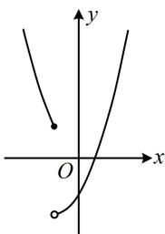
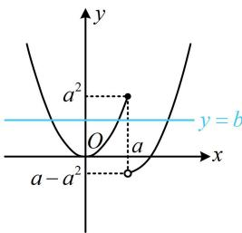

> [!faq]- 《第2节 分段函数中的动态分段点问题》参考答案
>
> > [!success]- **【答案】** (2022·北京模拟·★★★) 一数·必刷100讲 设函数 $f(x) = \begin{cases} x^2, & x \leq a \\ x^2 - 2ax + a, & x > a \end{cases}$ ，若存在实数 $b$ ，使得函数 $g(x) = f(x) - b$ 有 3 个零点，则 $a$ 的取值范围为 \_\_\_\_. $$ \left(\frac {1}{2}, + \infty\right) $$
>
> > [!note]- **【分析】**
> > 本题未单列分析。
>
> > [!note]- **【解析】**
> > 解析：$g(x) = 0\Leftrightarrow f(x) = b$ ，故 $g(x)$ 有3个零点 $\Leftrightarrow$ 直线 $y = b$ 与 $f(x)$ 的图象有3个交点，
> >
> > 两段上 $f(x)$ 都是二次函数，对称轴分别为 $x = 0$ 和 $x = a$ ，可以讨论 $a$ 与0的大小来作图分析，
> > - **①**：当 $a < 0$ 时， $f(x)$ 的图象如图1所示，
> >
> > 由于 $f(x)$ 在 $(- \infty, a]$ 上 $\searrow$ ，在 $(a, +\infty)$ 上 $\nearrow$
> >
> > 所以直线 $y = b$ 与 $f(x)$ 的图象至多2个交点，不合题意；
> > - **②**：当 $a = 0$ 时， $f(x) = x^2$ ，不合题意；
> > - **③**：当 $a > 0$ 时，如图2，要使存在直线 $y = b$ 与 $f(x)$ 的图象有3个交点，应有间断点处左侧的点位于右侧的上方，
> >
> > 所以 $a^2 > a - a^2$ ，故 $a > \frac{1}{2}$ ；
> >
> > 综上所述， $a$ 的取值范围为 $\left(\frac{1}{2}, +\infty\right)$
> >
> >   
> > 图1
> >
> >   
> > 图2
