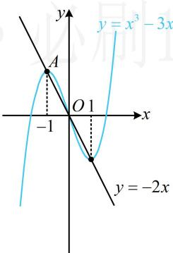
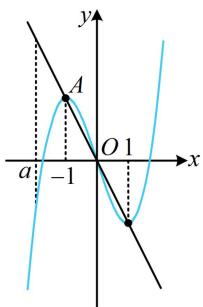
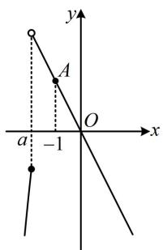
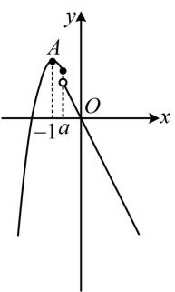
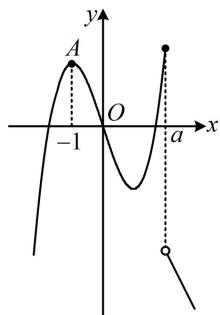

> [!faq]- 《第2节 分段函数中的动态分段点问题》参考答案
>
> > [!success]- **【答案】** 详见解析
>
> > [!note]- **【分析】**
> > 本题未单列分析。
>
> > [!note]- **【解析】**
> > 解析：观察发现 $f(x)$ 两段的解析式都不复杂，故可考虑画出两段解析式完整的图象，再看分段点在何处能满足题设条件， $y = x^3 - 3x \Rightarrow y' = 3x^2 - 3 = 3(x + 1)(x - 1)$ ，所以 $y' > 0 \Leftrightarrow x < -1$ 或 $x > 1$ ， $y' < 0 \Leftrightarrow -1 < x < 1$ ，故 $y = x^3 - 3x$ 在 $(- \infty, -1)$ 上 $\nearrow$ ，在 $(-1, 1)$ 上 $\searrow$ ，在 $(1, +\infty)$ 上 $\nearrow$ ，又当 $x = -1$ 时， $y = 2$ ，当 $x = 1$ 时， $y = -2$ ，记 $A(-1, 2)$ ，所以 $y = x^3 - 3x$ 的大致图象如图1（图1中把 $y = -2x$ 也画出来了，二者的交点恰好在 $y = x^3 - 3x$ 极值点处），
> >
> >   
> > 图1
> >
> > 分段点 $a$ 在哪里能使 $f(x)$ 没有最大值？直观想象可发现只能一次函数那段图象的左端点比三次函数那段图象都高，故 $a$ 只能在图2所示的位置（点 $A$ 的左边），我们擦掉干扰部分，把此时 $f(x)$ 的图象画出来，如图3. 若 $a$ 在 $A$ 的右侧，则 $f(x)$ 显然存在最大值（在 $x = -1$ 或 $x = a$ 处取得，分别如图4，图5），不合题意. 到此就分析清楚了，只需 $a$ 在 $A$ 左侧即可满足题意，要使 $f(x)$ 没有最大值，只能是图3的情况，应有 $a < -1$ .
> >
> >   
> > 图2
> >
> > 
> >
> >   
> > 图4
> >
> > 图3  
> >   
> > 图5
