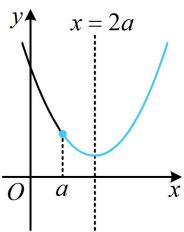
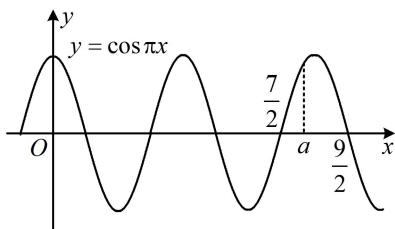
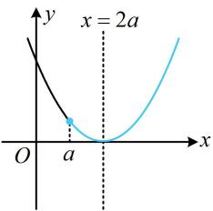
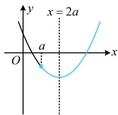
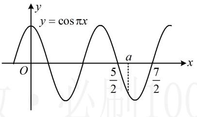
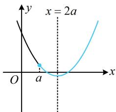
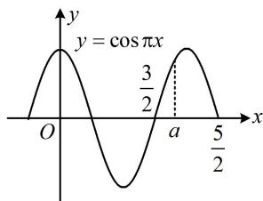

> [!faq]- 《第2节 分段函数中的动态分段点问题》参考答案
>
> > [!success]- **【答案】** 1; $\left(\frac{3}{2}, \frac{2\sqrt{6}}{3}\right] \cup \left(\frac{5}{2}, \frac{7}{2}\right]$
>
> > [!note]- **【分析】**
> > 本题未单列分析。
>
> > [!note]- **【解析】**
> > 解析：当 $a = 1$ 时， $f(x) = \begin{cases} \cos \pi x, & 0 < x < 1 \\ x^2 - 4x + 8, & x \geq 1 \end{cases}$ ，
> >
> > 求分段函数的零点个数，可分段考虑，
> >
> > 在 $(0,1)$ 上， $f(x)=\cos\pi x$ ，
> >
> > 令 $f(x) = 0$ 可得 $\cos \pi x = 0$ ，解得： $x = \frac{1}{2}$
> >
> > 在 $[1, +\infty)$ 上， $f(x) = x^2 - 4x + 8 = (x - 2)^2 + 4 \geq 4 > 0$
> >
> > 所以 $f(x)$ 在 $[1, +\infty)$ 上没有零点；
> >
> > 综上所述， $f(x)$ 只有 $x = \frac{1}{2}$ 这1个零点；
> >
> > 再看第二空， $f(x)$ 一共4个零点，那么两段上的零点个数如何分配？注意到在 $[a,+\infty)$ 上， $f(x)$ 为二次函数，其零点个数只可能是0，1，2，故可据此分三类讨论。为了找到讨论的分界点，不妨画二次函数的图象来看，
> > - **①**：当 $f(x)$ 在 $[a, +\infty)$ 无零点时，如图1， $\Delta = 16a^2 -32 <   0$
> >
> > 所以 $0 < a < \sqrt{2}$ ，此时 $f(x)$ 在 $(0, a)$ 上应有4个零点，
> >
> > 所以 $f(x)$ 在 $(0,a)$ 上的情形如图2，需满足 $\frac{7}{2} < a \leq \frac{9}{2}$ ，
> >
> > 这与 $0 < a < \sqrt{2}$ 无交集，所以不可能出现这种情况；
> >
> > 
> >
> >   
> > 图1  
> > 图2
> > - **②**：当 $f(x)$ 在 $[a, +\infty)$ 上有1个零点时，如图3或图4，
> >
> >   
> > 图3
> >
> >   
> > 图4
> >
> > $\Delta = 16a^{2} - 32 = 0$ 或 $f(a) = 8 - 3a^2 < 0$
> >
> > 所以 $a=\sqrt{2}$ 或 $a>\frac{2\sqrt{6}}{3}$ (i),
> >
> > 此时 $f(x)$ 在 $(0, a)$ 上应有3个零点，如图5，
> >
> >   
> > 图5
> >
> > 需满足 $\frac{5}{2} < a \leq \frac{7}{2}$ ，与(i)取公共部分仍为 $\frac{5}{2} < a \leq \frac{7}{2}$ ；
> > - **③**：当 $f(x)$ 在 $[a, +\infty)$ 上有2个零点时，如图6，
> >
> > $\left\{ \begin{array}{l} \Delta = 16a^{2} - 32 > 0 \\ f(a) = 8 - 3a^{2} \geq 0 \end{array} \right.$ ，所以 $\sqrt{2} < a \leq \frac{2\sqrt{6}}{3}$ (ii),
> >
> > 此时 $f(x)$ 在 $(0, a)$ 上应有2个零点，如图7，
> >
> > 需满足 $\frac{3}{2} < a \leq \frac{5}{2}$ ，与(ii)取公共部分可得 $\frac{3}{2} < a \leq \frac{2\sqrt{6}}{3}$ ；
> >
> > 综上所述， $a$ 的取值范围是 $\left(\frac{3}{2},\frac{2\sqrt{6}}{3}\right]\cup \left(\frac{5}{2},\frac{7}{2}\right].$
> >
> >   
> > 图6
> >
> >   
> > 图7
