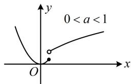
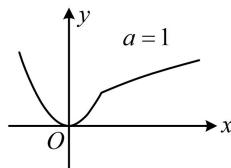
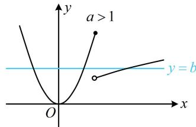

> [!faq]- 《第2节 分段函数中的动态分段点问题》参考答案
>
> > [!success]- **【答案】** $(1, +\infty)$
>
> > [!note]- **【分析】**
> > 本题未单列分析。
>
> > [!note]- **【解析】**
> > 解析：$g(x) = 0\Leftrightarrow f(x) = b$ ，所以问题等价于存在水平直线 $y = b$ 和 $f(x)$ 的图象有3个交点，
> >
> > 注意到函数 $y = x^2$ 和 $y = \sqrt{x}$ 的交点是(1,1)，所以分 $0 < a <$
> >
> > 1, a=1, a>1 三种情况画图分析,
> >
> > 如图，由图可知，只有当 $a > 1$ 时，才能画出水平直线 $y = b$ 与 $f(x)$ 的图象有3个交点，所以 $a > 1$
> >
> > 
> >
> > 
> >
> > 
