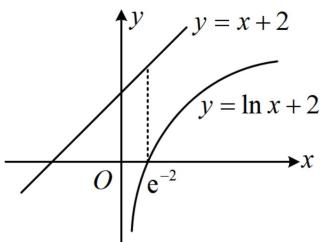
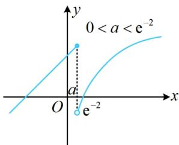
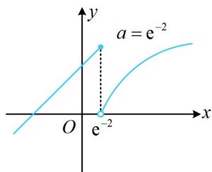
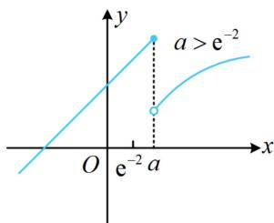

> [!faq]- 《第2节 分段函数中的动态分段点问题》例题解析
>
> > [!success]- **【答案】** A
>
> > [!note]- **【分析】**
> > 本题未单列分析。
>
> > [!note]- **【解析】**
> > 解法1：分段函数研究零点，分段分别考虑，注意到 $f(x)$ 在 $(- \infty, a]$ 和 $(a, +\infty)$ 上均 $\nearrow$
> >
> > 所以要使 $f(x)$ 有2个零点，应满足 $f(x)$ 在 $(- \infty, a]$ 和 $(a, +\infty)$ 上各有1个零点，当 $x \in (-\infty, a]$ 时， $f(x) = x + 2$ ，令 $f(x) = 0$ 可得 $x = -2$ ，因为 $a > 0$ ，所以 $-2 \in (-\infty, a]$ ，故-2是 $f(x)$ 的1个零点；当 $x \in (a, +\infty)$ 时， $f(x) = \ln x + 2$ ，令 $f(x) = 0$ 可得 $x = \frac{1}{\mathrm{e}^2}$ ，所以 $\frac{1}{\mathrm{e}^2} \in (a, +\infty)$ ，故 $0 < a < \frac{1}{\mathrm{e}^2}$ .
> >
> > 解法2: $f(x)$ 在两段上的解析式都很简单, 可画图分析, 注意到 $\ln x + 2 = 0 \Leftrightarrow x = \mathrm{e}^{-2}$ , 所以按 $a$ 和 $\mathrm{e}^{-2}$ 的大小来讨论, 先把 $y = x + 2$ 和 $y = \ln x + 2$ 的完整曲线画出来, 如图1, 当 $0 < a < \mathrm{e}^{-2}$ 时, $f(x)$ 的图象如图2, 由图可知 $f(x)$ 在 $(- \infty, a]$ 和 $(a, + \infty)$ 上各有1个零点, 满足题意; 当 $a = \mathrm{e}^{-2}$ 时, $f(x)$ 的图象如图3, 由图可知 $f(x)$ 仅在 $(- \infty, a]$ 上有1个零点, 不合题意; 当 $a > \mathrm{e}^{-2}$ 时, $f(x)$ 的图象如图4, 由图可知 $f(x)$ 仅在 $(- \infty, a]$ 上有1个零点, 不合题意; 综上所述, $a$ 的取值范围是 $(0, \mathrm{e}^{-2})$ , 即 $\left(0, \frac{1}{\mathrm{e}^2}\right)$ .
> >
> >
> >   
> > 图1
> >
> >   
> > 图2
> >
> >   
> > 图3
> >
> >   
> > 图4
