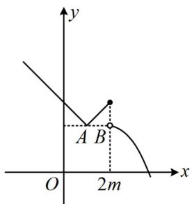
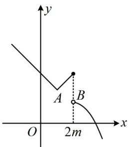
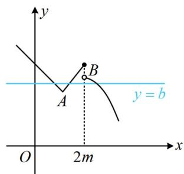
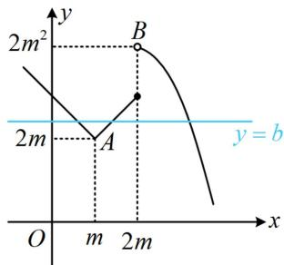

> [!faq]- 《第2节 分段函数中的动态分段点问题》例题解析
>
> > [!success]- **【答案】** B
>
> > [!note]- **【分析】**
> > 本题未单列分析。
>
> > [!note]- **【解析】**
> > 解析：由题意，问题等价于存在直线 $y = b$ 与 $f(x)$ 的图象有3个交点，要画 $f(x)$ 的图象，不妨先把 $x \leq 2m$ 那一段的绝对值去掉，将解析式细分为三段，分别作图，当 $x \in (-\infty, m)$ 时， $f(x) = -(x - m) + 2m = 3m - x$ ；当 $x \in [m, 2m]$ 时， $f(x) = (x - m) + 2m = x + m$ ；
> >
> > 所以 $f(x)$ 在 $(- \infty, m)$ 上 $\searrow$ ，在 $[m, 2m]$ 上 $\nearrow$ ;
> >
> > 当 $x > 2m$ 时， $f(x) = -x^2 + 4mx - 2m^2 = -(x - 2m)^2 + 2m^2$ ，所以 $f(x)$ 在 $(2m, +\infty)$ 上 $\searrow$ ；
> >
> > 水平直线 $y = b$ 与 $y = f(x)$ 图象可能的交点个数与间断点 $x = 2m$ 处的拼接情况有关，故应据此讨论，
> >
> > 记 $f(x)$ 图象上的两个分段点分别为 $A(m,2m)$ ， $B(2m,2m^2)$ ，
> >
> > 若 $A, B$ 等高或 $A$ 在 $B$ 的上方，如图1、图2，都不存在直线 $y = b$ 与 $f(x)$ 的图象有3个交点；
> >
> > 若 $A$ 在 $B$ 的下方，如图3和图4，存在直线 $y = b$ 与 $f(x)$ 的图象有3个交点，所以 $2m < 2m^2$ ，故 $m > 1$
> >
> >
> >   
> > 图1
> >
> >   
> > 图2
> >
> >   
> > 图3
> >
> >   
> > 图4
>
> > [!tip]- **【总结】**
> > 含参的分段函数问题，常考虑画图辅助分析，会比较直观，想象分段点变化时图形的运动过程，抓住关键位置，但注意不要遗漏.
