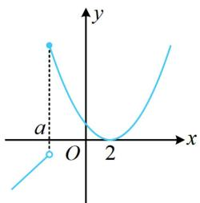
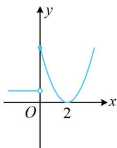
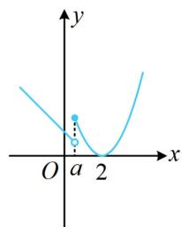
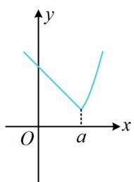
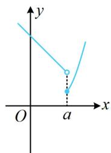

> [!faq]- 《第2节 分段函数中的动态分段点问题》例题解析
>
> > [!success]- **【答案】** 0（答案不唯一，见解析），1
>
> > [!note]- **【分析】**
> > 本题未单列分析。
>
> > [!note]- **【解析】**
> > 解析：因为当 $x < a$ 时， $f(x) = -ax + 1$ 的单调性与 $a$ 的正负有关，所以由此讨论，画出 $f(x)$ 的图象，
> >
> > 当 $a < 0$ 时， $f(x)$ 的图象如图1，由图可知 $f(x)$ 无最小值，不合题意；
> >
> > 当 $a = 0$ 时， $f(x)$ 的图象如图2，由图可知 $f(x)$ 有最小值，满足题意；第一空可填0；
> >
> > 当 $a > 0$ 时，由于当 $x \geq a$ 时， $f(x) = (x - 2)^2$ ，函数 $y = (x - 2)^2$ 的对称轴是 $x = 2$ ，故又讨论 $a$ 与 2 的大小，若 $0 < a < 2$ ，则要使 $f(x)$ 存在最小值， $f(x)$ 的图象应如图 3，
> >
> > 射线 $y = -ax + 1 (x < a)$ 的右端点不能落到 x 轴下方，所以 $-a^{2} + 1 \geq 0$ ，故 $0 < a \leq 1$ ;
> >
> > 若 $a \geq 2$ ，则要使 $f(x)$ 存在最小值， $f(x)$ 的图象应如图4或图5，
> >
> > 所以 $-a^2 + 1 \geq (a - 2)^2$ ，整理得： $2a^2 - 4a + 3 \leq 0$ ，无解；
> >
> > 综上所述，当 $f(x)$ 存在最小值时， $a$ 的取值范围是[0,1]，所以 $a$ 的最大值为1.
> >
> >
> >   
> > 图1
> >
> >   
> > 图2
> >
> >   
> > 图3
> >
> >   
> > 图4
> >
> >   
> > 图5
>
> > [!tip]- **【反思】**
> > 本题难点在于如何准确分类, 不妨思考一下分类的依据: 要确定 $f(x)$ 的最小值, 就得明确函数两段的单调性, 而 $a$ 与 0 的大小关系决定左段射线的单调性, $a$ 与 2 的大小决定右段单调性, 故根据 0, 2 顺次分类,
> >
> > 即可明确图象找到最小值.
