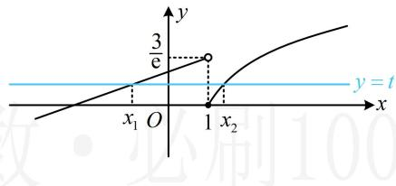

> [!faq]- 《第3节 等高线问题》参考答案
>
> > [!success]- **【答案】** 2
>
> > [!note]- **【分析】**
> > 本题未单列分析。
>
> > [!note]- **【解析】**
> > 解析：欲求 $x_{2} - x_{1}$ 的最小值，先通过设 $t$ 将变量统一起来，
> >
> > 设 $f(x_{1}) = f(x_{2}) = t$ ，如图，由图可知 $0\leq t <   \frac{3}{\mathrm{e}}$
> >
> > 且 $x_{1} < 1 \leq x_{2}$ ，所以 $f(x_{1}) = \frac{1}{\mathbf{e}} (x_{1} + 2) = t \Rightarrow x_{1} = \mathbf{e}t - 2$ ，
> >
> > $f(x_{2}) = \ln x_{2} = t\Rightarrow x_{2} = \mathrm{e}^{t}$ ，从而 $x_{2} - x_{1} = \mathrm{e}^{t} - \mathrm{e}t + 2$
> >
> > 统一了变量，接下来将右侧构造成函数，求导研究最值，
> >
> > 设 $\varphi(t) = \mathbf{e}^t -\mathbf{e}t + 2\left(0\leq t <   \frac{3}{\mathbf{e}}\right)$ ，则 $\varphi'(t) = \mathbf{e}^t -\mathbf{e}$
> >
> > 所以 $\varphi'(t) > 0 \Leftrightarrow 1 < t < \frac{3}{\mathfrak{e}}$ ， $\varphi'(t) < 0 \Leftrightarrow 0 \leq t < 1$ ，
> >
> > 从而 $\varphi(t)$ 在 $[0,1)$ 上 $\searrow$ ，在 $\left(1,\frac{3}{\mathrm{e}}\right)$ 上 $\nearrow$
> >
> > 故 $\varphi(t)_{\min} = \varphi(1) = 2$ ，即 $x_{2} - x_{1}$ 的最小值为2.
> >
> > 
