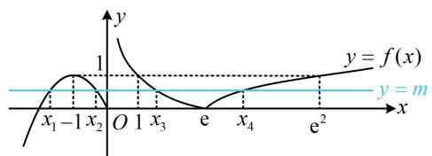

> [!faq]- 《第3节 等高线问题》参考答案
>
> > [!success]- **【答案】** 详见解析
>
> > [!note]- **【分析】**
> > 本题未单列分析。
>
> > [!note]- **【解析】**
> > $2 \sqrt{2} e$
> >
> > $$
> > y = m
> > $$
> >
> > $$
> > y = f (x)
> > $$
> >
> > $$
> > f (x) = m
> > $$
> >
> > $$
> > x _ {2}
> > $$
> >
> > $$
> > \frac {x _ {1} + x _ {2}}{2} = - 1
> > $$
> >
> > $$
> > 0 <   m <   1
> > $$
> >
> > $$
> > x _ {1}
> > $$
> >
> > $$
> > x _ {1} + x _ {2} = - 2
> > $$
> >
> > 故 $x_{4} - (x_{1} + x_{2})x_{3} = x_{4} + 2x_{3}$ ①，
> >
> > 要求式①的最小值，考虑寻找 $x_{3}$ 和 $x_{4}$ 的关系，可由
> >
> > $f(x_{3}) = f(x_{4})$ 来找，由图可知， $1 <   x_{3} <   \mathrm{e} <   x_{4} <   \mathrm{e}^{2}$
> >
> > 所以 $0 < \ln x_{3} < 1$ ， $1 < \ln x_{4} < 2$
> >
> > 由 $f(x_{3}) = f(x_{4})$ 可得 $\left|1 - \ln x_3\right| = \left|1 - \ln x_4\right|$
> >
> > 所以 $1 - \ln x_{3} = \ln x_{4} - 1$ ，从而 $\ln x_3 + \ln x_4 = \ln (x_3x_4) = 2$
> >
> > 故 $x_{3}x_{4} = \mathrm{e}^{2}$ ，所以由①可得 $x_{4} - (x_{1} + x_{2})x_{3} = x_{4} + 2x_{3}$
> >
> > $\geq2\sqrt{x_{4}\cdot2x_{3}}=2\sqrt{2}e$ ，取等条件是 $x_{4}=2x_{3}$ ，
> >
> > 结合 $x_{3}x_{4} = \mathrm{e}^{2}$ 可得 $x_{3} = \frac{\sqrt{2}\mathrm{e}}{2}, x_{4} = \sqrt{2}\mathrm{e}$
> >
> > 故 $[x_4 - (x_1 + x_2)x_3]_{\min} = 2\sqrt{2}\mathrm{e}$
> >
> > 
> >
> > 一数·必刷100讲
