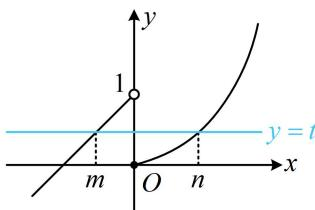
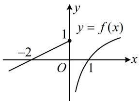
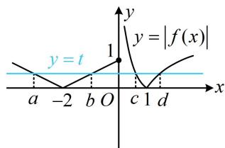

<!-- source-part:1 pages:1-2 -->

# 第 3 节 等高线问题（★★★☆）

## 内容提要

本节归纳分段函数中的等高线问题. 例如, 题干给出分段函数 $f(x)$ 满足 $f(m) = f(n)$ , 让求某个关于 $m$ 和 $n$ 的式子的取值范围, 这类题常设 $f(m) = f(n) = t$ , 将 $m$ 与 $n$ 都用 $t$ 表示, 再代入目标代数式求范围.

【例题】已知函数 $f(x) = \begin{cases} \mathrm{e}^x - 1, & x \geq 0 \\ x + 1, & x < 0 \end{cases}$ ，若 $m < n$ ，且 $f(m) = f(n)$ ，则 $n - m$ 的最大值是（）A. ln2 B. 1 C. 2 D. ln3

解析：设 $f(m) = f(n) = t$ ，如图，由图可知 $0 \leq t < 1$ ，且 $m < 0 \leq n$ ，所以 $f(m) = m + 1 = t \Rightarrow m = t - 1$ ， $f(n) = \mathrm{e}^{n} - 1 = t \Rightarrow n = \ln (t + 1)$ ，故 $n - m = \ln (t + 1) - t + 1$

变量统一了，可把 $n - m$ 看成关于 $t$ 的函数，求导研究最值，设 $\varphi(t) = \ln (t + 1) - t + 1 (0 \leq t < 1)$ ，则 $\varphi'(t) = \frac{1}{t + 1} - 1 = -\frac{t}{t + 1} \leq 0$ 所以 $\varphi(t)$ 在 $[0,1)$ 上 $\searrow$ ，从而 $\varphi(t)_{\max} = \varphi(0) = 1$ ，故 $n - m$ 的最大值为 1. 答案：B

【总结】如果分段函数下出现了函数值相等条件，如 $f(m) = f(n)$ ，或 $f(a) = f(b) = f(c)$ ，这类问题我们称为等高线问题，往往会将这个“高”设出来，达到消元的目的。如本题我们令 $f(m) = f(n) = t$ ，进而将 $m$ 与 $n$ 都用一个变量 $t$ 表示出来，后续的分析就方便了。

【变式】已知函数 $f(x) = \begin{cases} \frac{1}{2} x + 1, & x \leq 0 \\ \lg x, & x > 0 \end{cases}$ ，若存在不相等的实数 $a, b, c, d$ 满足 $|f(a)| = |f(b)| =$

$$
\left| f (c) \right| = \left| f (d) \right|
$$

$$
a + b + c + d
$$

$$
(0, + \infty)
$$

$$
\left(- 2, \frac {8 1}{1 0} \right]
$$

$$
\left(- 2, \frac {6 1}{1 0} \right]
$$

$$
\left(0, \frac {8 1}{1 0} \right]
$$

解析：条件给的是函数 $y = |f(x)|$ 在 $a, b, c, d$ 处函数值相等，故用 $y = |f(x)|$ 的图象来分析问题，先画图，函数 $y = f(x)$ 的大致图象如图1， $y = |f(x)|$ 的大致图象如图2，设 $|f(a)| = |f(b)| = |f(c)| = |f(d)| = t$ ，不妨设 $a < b < c < d$ ，由图2知 $0 < t \leq 1, 0 < c < 1 < d$ ，

$$
y = \left| f (x) \right|
$$

$$
a + b = - 4
$$

$$
\left| f (c) \right| = t
$$

$$
\left| f (d) \right| = t
$$

$$
0 <   c <   1
$$

$$
d > 1
$$

$$
\lg c <   0
$$

$$
\lg d > 0
$$

$$
\left| f (c) \right| = \left| \lg c \right| = - \lg c = t
$$

$$
\left| f (d) \right| = \left| \lg d \right| = \lg d = t
$$

$$
c = 1 0 ^ {- t}
$$

$$
d = 1 0 ^ {t}
$$

$$
a + b + c + d = - 4 + 1 0 ^ {- t} + 1 0 ^ {t}
$$

$$
1 0 ^ {- t} = \frac {1}{1 0 ^ {t}}
$$

令 $u = 10^{t}$ ，则 $1 < u \leq 10$ ，且 $a + b + c + d = -4 + \frac{1}{u} + u$ ，设 $\varphi(u) = -4 + \frac{1}{u} + u (1 < u \leq 10)$ ，则 $\varphi'(u) = -\frac{1}{u^2} + 1 > 0$

所以 $\varphi(u)$ 在(1,10]上，

又 $\varphi(1) = -2$ ， $\varphi(10) = \frac{61}{10}$ ，所以 $\varphi(u)$ 的值域为 $\left(-2, \frac{61}{10}\right]$ ，

故 $a + b + c + d$ 的取值范围是 $\left(-2, \frac{61}{10}\right]$ .

  
图1

  
图2

答案: C

【反思】题干中关于 $|f(a)|$ 的连等式容易让人困扰，但为了使该条件与已知函数形式统一，自然想到研究函数 $y = |f(x)|$ ；另外，若函数有对称性，结合对称性往往能简化步骤，本题 $a + b$ 就是通过对称性快速求出的.

![[高中/总复习/教辅/一数常规版2026/第3章 函数与导数/模块4：分段函数问题/第3节 等高线问题/强化训练/强化训练.md]]
