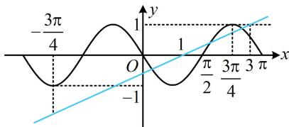

> [!faq]- 《第1节 函数零点小题策略：不含参》参考答案
>
> > [!success]- **【答案】** C
>
> > [!note]- **【分析】**
> > 本题未单列分析。
>
> > [!note]- **【解析】**
> > C
> > 解析：由题意， $f(x)=\cos\left[2\left(x+\frac{\pi}{6}\right)+\frac{\pi}{6}\right]=\cos\left(2x+\frac{\pi}{2}\right)$ $=-\sin 2x,\quad f(x)$ 的最小正周期 $T=\pi$ 如图，容易看出 y 轴左侧二者没有交点，而 y 轴右侧， $y=-\sin 2x$ 在直线 y=1 上方没有图象，故可抓住蓝色直线穿出 y=1 的位置来分析，
> > 在 $y=\frac{1}{2}x-\frac{1}{2}$ 中令 y=1 可得 x=3 ，如图， $\frac{3\pi}{4}<3<\pi$ 所以直线 $y=\frac{1}{2}x-\frac{1}{2}$ 与 $f(x)$ 的图象共 3 个交点.
> >
> > 
