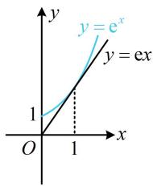
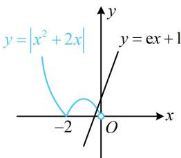
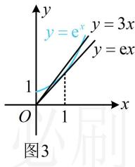

> [!faq]- 《第1节 函数零点小题策略：不含参》参考答案
>
> > [!success]- **【答案】** C
>
> > [!note]- **【分析】**
> > 本题未单列分析。
>
> > [!note]- **【解析】**
> > C
> >
> > 解析：分段函数研究零点个数，可分段考虑，
> >
> > 当 $x \geq 0$ 时， $g(x) = f(x) - \mathrm{e}x - 1 = \mathrm{e}^x - \mathrm{e}x$
> >
> > 所以 $g(x) = 0 \Leftrightarrow \mathrm{e}^x = \mathrm{e}x$ ，接下来借助图象分析交点，
> >
> > 如图1，直线 $y = \mathrm{e}x$ 与曲线 $y = \mathrm{e}^x$ 正好相切于 $x = 1$ 处，它们只有1个交点 $\Rightarrow g(x)$ 在 $[0, +\infty)$ 上有1个零点；
> >
> > 当 $x < 0$ 时， $g(x) = 0 \Leftrightarrow |x^2 + 2x| = \mathrm{e}x + 1$
> >
> > 此方程不易求解，故作图看交点，
> >
> > 如图2，由图可知直线 $y = \mathrm{e}x + 1$ 与函数 $y = |x^2 + 2x| (x < 0)$ 的图象有1个交点，所以 $g(x)$ 在 $(- \infty, 0)$ 上有1个零点，故 $g(x)$ 共有2个零点.
> >
> > 
> >
> >   
> > 图1  
> > 图2
>
> > [!tip]- **【反思】**
> > 本题若将 $g(x)=f(x)-\mathrm{e}x-1$ 换成 $g(x)=f(x)-3x-1$ ，你会做吗？在 $[0,+\infty)$ 上，原来的曲线 $y=e^{x}$ 的切线 y=ex 变成割线 y=3x，如图3，交点增加1个.
> >
> > 
