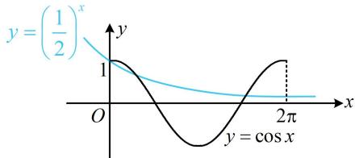

> [!faq]- 《第1节 函数零点小题策略：不含参》参考答案
>
> > [!success]- **【答案】** B
>
> > [!note]- **【分析】**
> > 本题未单列分析。
>
> > [!note]- **【解析】**
> > 解析：直接分析 $f(x)$ 的零点不易，考虑将 $f(x) = 0$ 变形，便于作图分析交点个数， $f(x) = 0 \Leftrightarrow \left(\frac{1}{2}\right)^x = \cos x$ ，作出 $y = \left(\frac{1}{2}\right)^x$ 和 $y = \cos x$ 在 $[0, 2\pi]$ 上的图象如图，两图象有3个交点 $\Rightarrow f(x)$ 在 $[0, 2\pi]$ 上有3个零点.
> >
> > 
