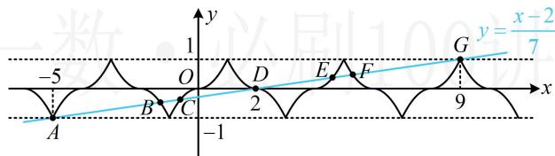

> [!faq]- 《第1节 函数零点小题策略：不含参》参考答案
>
> > [!success]- **【答案】** B
>
> > [!note]- **【分析】**
> > 本题未单列分析。
>
> > [!note]- **【解析】**
> > B
> > 解析： $7f(x)-x+2=0\Leftrightarrow f(x)=\frac{x-2}{7}$
> >
> > 为了作图，先由已知条件分析 $f(x)$ 的性质，
> >
> > $$
> > f (- x) + f (x) = 0 \Rightarrow f (x)
> > $$
> >
> > $$
> > f (x) = f (2 - x)
> > $$
> >
> > $$
> > f (x) = x ^ {2}
> > $$
> >
> > 注意到 $f(x)$ 只在直线 $y = -1$ 和 $y = 1$ 之间有图象，故作图时注意直线 $y = \frac{x - 2}{7}$ 穿出此两水平线的位置，
> >
> > 由图可知两图象有 $A, B, C, D, E, F, G$ 共7个交点，
> >
> > 因为两个图象都关于点(2,0)对称，所以它们的交点也关于点(2,0)对称，从而 $A$ 与 $G$ ， $B$ 与 $F$ ， $C$ 与 $E$ 都关于 $D(2,0)$ 对称，故 $\frac{x_A + x_G}{2} = 2$ ， $\frac{x_B + x_F}{2} = 2$ ， $\frac{x_C + x_E}{2} = 2$
> >
> > 所以 $x_{A} + x_{B} + x_{C} + x_{D} + x_{E} + x_{F} + x_{G} = 4\times 3 + 2 = 14$
> >
> > 即函数 $y=7f(x)-x+2$ 的所有零点之和为 14.
> >
> > 
