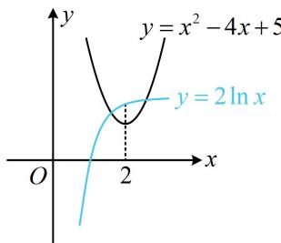
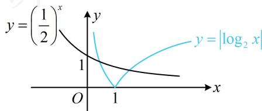
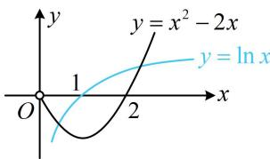
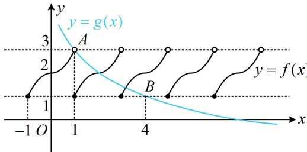
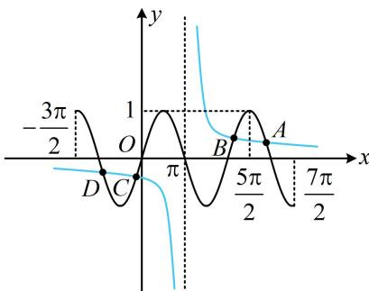

<!-- source-part:1 pages:1-3 -->

# 模块五 零点与不等式

# 第1节 函数零点小题策略：不含参（★★☆）

内容提要

不含参的函数零点小题一般有两种处理方法：

1. 令 $f(x) = 0$ ，解方程，得出零点个数。

2. 若方程 $f(x) = 0$ 不好解，可将其等价变形成 $g(x) = h(x)$ ，则 $y = g(x)$ 和 $y = h(x)$ 图象的交点个数，即为 $f(x)$ 的零点个数。等价变形成什么样子，应该以便于作图分析为考虑方向。

【例1】函数 $f(x) = 2\ln x$ 的图象与 $g(x) = x^{2} - 4x + 5$ 的图象的交点个数为（）A.3 B.2 C.1 D.0

解析：直接画图看交点，因为 $g(x)$ 的对称轴是 $x = 2$ ，所以画图时应重点关注这个位置，

如图，因为 $f(2) = 2\ln 2 > g(2) = 1$ ，所以两图象有2个交点.

答案: B

【例 2】函数 $f(x)=2^{x}\cdot\left|\log_{2}x\right|-1$ 的零点个数为 \_\_\_\_.

解析： $f(x)$ 的图象不好画，故考虑先将 $f(x) = 0$ 等价变形，把 $2^{x}$ 和 $\left|\log_2x\right|$ 分开，再画图看交点， $f(x) = 0\Leftrightarrow 2^{x}\cdot \left|\log_2x\right| - 1 = 0\Leftrightarrow \left|\log_2x\right| = \left(\frac{1}{2}\right)^x,$ 如图，两图象有2个交点 $\Rightarrow f(x)$ 有2个零点.

答案: 2

【反思】当直接画 $f(x)$ 的图象来看零点个数不方便时，可考虑将方程 $f(x) = 0$ 等价变形成 $g(x) = h(x)$ 的形式，画 $g(x)$ 和 $h(x)$ 的图象看交点个数，变形应注意“等价”和“作图方便”两点.

【变式】函数 $f(x)=\left\{\begin{aligned}&4x+1,x\leq0\\&\ln x-x^{2}+2x,x>0\end{aligned}\right.$ 的零点个数为 \_\_\_\_.

解析：研究分段函数的零点个数，可分段来看，第一段比较简单，直接解方程 $f(x) = 0$

当 $x \leq 0$ 时， $f(x) = 4x + 1 = 0 \Rightarrow x = -\frac{1}{4} \Rightarrow f(x)$ 在 $(- \infty, 0]$ 上有 1 个零点；

第二段的零点解不出来，所以等价变形，再画图看交点，

当 $x > 0$ 时， $f(x) = \ln x - x^2 + 2x = 0 \Leftrightarrow \ln x = x^2 - 2x$

作出 $y = \ln x$ 和 $y = x^{2} - 2x(x > 0)$ 的大致图象如图，

由图可知二者有 2 个交点，所以 $f(x)$ 在 $(0, +\infty)$ 上有 2 个零点；

故 $f(x)$ 共有3个零点.

答案：3

【反思】分段函数的零点可分段研究，在每一段上，若零点能求出，则直接求，否则等价变形看交点.

【例3】定义在 $\mathbf{R}$ 上的函数 $f(x)$ 周期为2，当 $-1 \leq x < 1$ 时， $f(x) = \begin{cases} x^2 + 2, & 0 \leq x < 1 \\ 2 - x^2, & -1 \leq x < 0 \end{cases}$ ，设 $g(x) = 3 - \log_2 x$ ，则函数 $y = f(x) - g(x)$ 的零点个数为（）A. 1 B. 2 C. 3 D. 4

解析： $f(x)-g(x)=0\Leftrightarrow f(x)=g(x)$ ，下面作图看交点，由于 $f(x)$ 只在直线y=1和y=3之间部分有图象，所以作图时需注意 $g(x)$ 的图象与该两直线的交点A，B的位置，

令 $g(x) = 3$ 可得 $3 - \log_2 x = 3$ ，所以 $x = 1$ ，故 $A(1,3)$ ；  
令 $g(x) = 1$ 可得 $3 - \log_2 x = 1$ ，所以 $x = 4$ ，故 $B(4,1)$ ，  
所以 $y = f(x)$ 和 $y = g(x)$ 的大致图象如图，  
由图可知它们有2个交点，故选B.  
答案：B

【反思】务必注意空心点和实心点，空心点处必定不是交点.

【变式】函数 $f(x) = 1 - (x - \pi)\sin x$ 在区间 $\left[-\frac{3\pi}{2}, \frac{7\pi}{2}\right]$ 上的所有零点之和为（）
A. 0 B. 2π C. 4π D. 6π

解析：零点无法求出， $f(x)$ 的图象也不好画，故考虑等价变形看交点， $f(x)=0\Leftrightarrow(x-\pi)\sin x=1$ ①，为了便于作图，把 $x-\pi$ 除过去，先考虑其能否为 0，当 $x=\pi$ 时，方程①不成立；当 $x\neq\pi$ 时，方程①等价于 $\sin x=\frac{1}{x-\pi}$ ，接下来作图看交点，
不难发现 $y = \sin x$ 和 $y = \frac{1}{x - \pi}$ 的图象都关于点 $(\pi, 0)$ 对称，所以它们的交点也关于点 $(\pi, 0)$ 对称，
曲线 $y = \sin x$ 的波峰与 $y = \frac{1}{x - \pi}$ 的位置关系对判断交点个数很重要，故应抓住 $x = \frac{5\pi}{2}$ 这个关键位置，

当 $x = \frac{5\pi}{2}$ 时， $\frac{1}{x - \pi} = \frac{2}{3\pi} <   \sin x = 1$ ，所以两图象如图，

由图可知它们共有 $A, B, C, D$ 这4个交点，

其中 $A$ 与 $D$ ， $B$ 与 $C$ 关于 $(\pi ,0)$ 对称，所以 $\frac{x_A + x_D}{2} = \pi$ ， $\frac{x_B + x_C}{2} = \pi$ 故 $x_{A} + x_{B} + x_{C} + x_{D} = 4\pi$ ，即 $f(x)$ 在 $\left[-\frac{3\pi}{2},\frac{7\pi}{2}\right]$ 上所有零点之和为 $4\pi$

答案: C

【反思】当题干让求零点之和时，可以考虑利用图象的对称性求解.

![[高中/总复习/教辅/一数常规版2026/第3章 函数与导数/模块5：零点与不等式/第1节 函数零点小题策略：不含参/强化训练/强化训练.md]]
