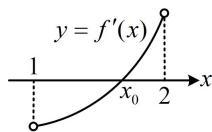

> [!faq]- 《第2节 函数零点小题策略：含参》参考答案
>
> > [!success]- **【答案】** $(-e - 4, -2)$
>
> > [!note]- **【分析】**
> > 本题未单列分析。
>
> > [!note]- **【解析】**
> > 解析：注意到(1,2)为开区间，最值不可能在端点取，所以要使 $f(x)$ 在(1,2)上有最小值，则最小值一定在区间内部取得，可导函数区间内部的最值必为极值，于是求导分析 $f(x)$ 的极值情况，
> >
> > 由题意， $f^{\prime}(x) = x^{2} + \mathrm{e}^{x - 1} + m$ ，因为在(1,2)上， $y = x^{2}$ 和
> >
> > $y=e^{x-1}+m$ 都 $\nearrow$ ，所以 $f'(x)$ 也 $\nearrow$ ，要使 $f(x)$ 在(1,2)上存在最小值，则 $f'(x)$ 在(1,2)上存在变号零点，
> >
> > 如图，应有 $\left\{ \begin{array}{l} f'(1) = 1 + \mathrm{e}^0 + m < 0 \\ f'(2) = 4 + \mathrm{e}^1 + m > 0 \end{array} \right. \Rightarrow -\mathrm{e} - 4 < m < -2$
> >
> > 此时 $f'(x)$ 在 $(1,2)$ 上有零点 $x_{0}$ ，且由图可知当 $x \in (1, x_{0})$ 时， $f'(x) < 0$ ，当 $x \in (x_{0}, 2)$ 时， $f'(x) > 0$ ，所以 $f(x)$ 在 $(1, x_{0})$ 上 $\searrow$ ，在 $(x_{0}, 2)$ 上 $\nearrow$ ，
> >
> > 所以 $f(x)$ 在(1,2)上有最小值 $f(x_0)$ ，满足题意，
> >
> > 故实数 $m$ 的取值范围是 $(-e - 4, -2)$ .
> >
> > 
