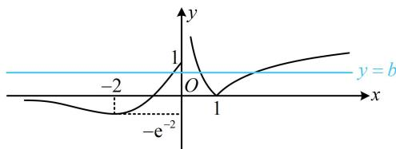

> [!faq]- 《第2节 函数零点小题策略：含参》参考答案
>
> > [!success]- **【答案】** BC
>
> > [!note]- **【分析】**
> > 本题未单列分析。
>
> > [!note]- **【解析】**
> > BC
> >
> > 解析：先将参数 $b$ 全分离出来，便于作图研究交点， $g(x) = 0 \Leftrightarrow f(x) - b = 0 \Leftrightarrow f(x) = b$
> >
> > 当 $x \leq 0$ 时， $f(x) = (x + 1)\mathrm{e}^x$ ， $f'(x) = (x + 2)\mathrm{e}^x$
> >
> > 所以 $f'(x) < 0 \Leftrightarrow x < -2$ ， $f'(x) > 0 \Leftrightarrow -2 < x \leq 0$ ，
> >
> > 故 $f(x)$ 在 $(- \infty, -2)$ 上 $\searrow$ ，在 $(-2,0]$ 上 $\nearrow$ ， $f(0) = 1$ ， $f(-2) = -\frac{1}{\mathrm{e}^2}$ ，且当 $x \to -\infty$ 时， $f(x) \to 0$ ，
> >
> > 据此可作出 $f(x)$ 的草图如图， $g(x)$ 有3个零点等价于直线 $y = b$ 与 $f(x)$ 的图象有3个交点，
> >
> > 由图可知 $0 < b \leq 1$ ，故选B、C.
> >
> > 
