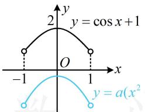
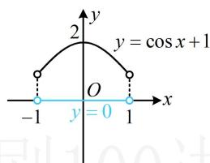
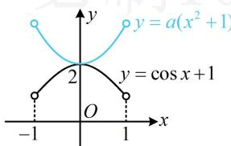

> [!faq]- 《第2节 函数零点小题策略：含参》参考答案
>
> > [!success]- **【答案】** A
>
> > [!note]- **【分析】**
> > 本题未单列分析。
>
> > [!note]- **【解析】**
> > 解法1：涉及交点，可考虑画图分析，直接画图比较麻烦，观察发现将 $f(x)$ 的 $a(x + 1)^2$ 展开，与 $g(x)$ 有 $2ax$ 这一相同的项，故先把这部分抵消掉再画图， $f(x) = g(x) \Leftrightarrow a(x + 1)^2 - 1 = \cos x + 2ax$ $\Leftrightarrow a(x^2 + 1) = \cos x + 1$ ，所以题设条件等价于 $y = a(x^2 + 1)$ 与 $y = \cos x + 1$ 在 $(-1, 1)$ 上的图象恰有1个交点，下面画图分析， $a$ 的正负会影响 $y = a(x^2 + 1)$ 的开口，故据此讨论，当 $a < 0$ 时，如图1，两图象没有交点，不合题意；当 $a = 0$ 时，如图2，两图象没有交点，不合题意；当 $a > 0$ 时，如图3，要使两图象恰有1个交点，则交点只能在 $x = 0$ 处，所以 $a(0^2 + 1) = \cos 0 + 1$ ，故 $a = 2$ ；综上所述， $a = 2$ 。
> >
> >   
> > 图1
> >
> >   
> > 图2
> >
> >   
> > 图3
> >
> > 解法2：观察发现抵消掉 $2ax$ 这部分后，余下的全是偶函数，故也可从奇偶性的角度来发现零点，
> >
> > $$
> > f (x) = g (x) \Leftrightarrow a (x + 1) ^ {2} - 1 = \cos x + 2 a x
> > $$
> >
> > $$
> > \Leftrightarrow a \left(x ^ {2} + 1\right) - \cos x - 1 = 0,
> > $$
> >
> > 令 $h(x)=a(x^{2}+1)-\cos x-1,\quad-1<x<1$
> >
> > 则题设条件等价于 $h(x)$ 恰有1个零点，注意到 $h(-x) =$
> >
> > $$
> > a [ (- x) ^ {2} + 1 ] - \cos (- x) - 1 = a (x ^ {2} + 1) - \cos x - 1 = h (x)
> > $$
> >
> > 所以 $h(x)$ 为偶函数，其零点除 $x = 0$ 外，必定以相反数成对出现，故 $h(x)$ 的零点只能是0，即 $h(0) = a - 2 = 0 \Rightarrow a = 2$
