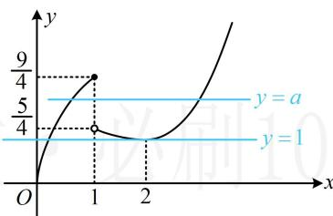

> [!faq]- 《第2节 函数零点小题策略：含参》参考答案
>
> > [!success]- **【答案】** 详见解析
>
> > [!note]- **【分析】**
> > 本题未单列分析。
>
> > [!note]- **【解析】**
> > 解析：先全分离，转化为水平直线与函数图象交点问题， $f(x) = -\frac{1}{4} x + a \Leftrightarrow f(x) + \frac{1}{4} x = a$ ，令 $g(x) = f(x) + \frac{1}{4} x$ ，则 $g(x) = \begin{cases} 2\sqrt{x} + \frac{x}{4}, & 0 \leq x \leq 1 \\ \frac{1}{4}\left(x + \frac{4}{x}\right), & x > 1 \end{cases}$ ，作出函数 $y = g(x)$ 的图象如图，当且仅当 $a = 1$ 或 $\frac{5}{4} \leq a \leq \frac{9}{4}$ 时，直线 $y = a$ 与 $y = g(x)$ 的图象有 2 个交点，满足题意.
> >
> > 
>
> > [!tip]- **【反思】**
> > 本题用半分离方法直接作图研究 $y = f(x)$ 和 $y = -\frac{1}{4} x + a$ 的交点也行，但模型更复杂，不妨自行尝试.
