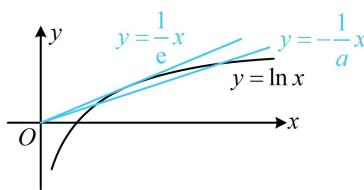

> [!faq]- 《第2节 函数零点小题策略：含参》参考答案
>
> > [!success]- **【答案】** C
>
> > [!note]- **【分析】**
> > 本题未单列分析。
>
> > [!note]- **【解析】**
> > 解析：观察可得 $g(x)$ 为奇函数，可先用对称性将研究的范围缩小，由题意， $g(-x)=f(-x)-f(x)=-g(x)$ ，
> > 所以 $g(x)$ 为奇函数，由对称性， $g(x)$ 有 5 个零点等价于 $g(x)$ 在 $(0,+\infty)$ 上有 2 个零点，接下来在 $(0,+\infty)$ 上考虑，
> > 当 $x \in (0, +\infty)$ 时， $g(x) = a \ln x - (-x) = a \ln x + x$ 所以 $g(x)=0\Leftrightarrow a\ln x+x=0\Leftrightarrow a\ln x=-x$ 接下来全分离、半分离均可，我们以半分离为例，两端同除以 a，转化为直线 $y=-\frac{x}{a}$ 与 $y=\ln x$ 有 2 个交点来研究，
> > 当 a=0 时， $a\ln x=-x$ 即为 0=-x，所以 x=0，
> > 不满足题意；
> >
> > 当 $a \neq 0$ 时， $a \ln x = -x \Leftrightarrow \ln x = -\frac{x}{a}$ ，如图，曲线 $y = \ln x$ 过原点的切线为 $y = \frac{1}{e} x$ ，所以要使 $y = -\frac{x}{a}$ 与 $y = \ln x$ 有2个交点，应有 $0 < -\frac{1}{a} < \frac{1}{e}$ ，故 $a < -e$ 。
> >
> > 
