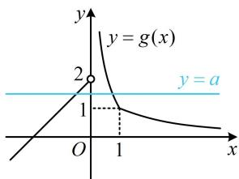
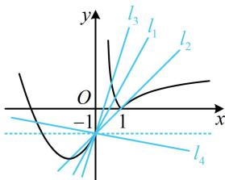

> [!faq]- 《第2节 函数零点小题策略：含参》参考答案
>
> > [!success]- **【答案】** B
>
> > [!note]- **【分析】**
> > 本题未单列分析。
>
> > [!note]- **【解析】**
> > B
> >
> > 解法1：观察可得方程 $f(x) = ax - 1$ 中参数 $a$ 可以全分离，故先试试全分离，由题意， $f(0) = -1$ ，所以 $x = 0$ 是方程 $f(x) = ax - 1$ 的1个实根；当 $x \neq 0$ 时， $f(x) = ax - 1 \Leftrightarrow a = \frac{f(x) + 1}{x}$ ，由题意，直线 $y = a$ 与 $y = \frac{f(x) + 1}{x}$ 的图象应有2个交点，设 $g(x) = \frac{f(x) + 1}{x} (x \neq 0)$ ，则 $g(x) = \begin{cases} \frac{|\ln x| + 1}{x}, & x > 0 \\ x + 2, & x < 0 \end{cases}$ ，
> >
> > 要画 $g(x)$ 的图象，需将 $x > 0$ 的部分去绝对值、求导，  
> > 当 $0 < x < 1$ 时， $g(x) = \frac{1 - \ln x}{x}$ ，所以 $g'(x) = \frac{\ln x - 2}{x^2} < 0$ ，故 $g(x)$ 在 $(0,1)$ 上 $\searrow$ ，当 $x > 1$ 时， $g(x) = \frac{\ln x + 1}{x}$ ，所以 $g'(x) = -\frac{\ln x}{x^2} < 0$ ，  
> > 故 $g(x)$ 在 $(1, +\infty)$ 上 $\searrow$ ，  
> > 又 $\lim_{x \to 0^+} g(x) = +\infty$ ， $g(1) = 1$ ， $\lim_{x \to +\infty} g(x) = 0$ ，
> >
> > 所以 $g(x)$ 的大致图象如图1，由图可知当且仅当 $0 < a < 2$ 时，直线 $y = a$ 与函数 $y = \frac{f(x) + 1}{x}$ 的图象有2个交点.
> >
> > ## 解法2: 本题半分离也可行, 但模型较复杂, 下面直接作图研究直线 $y = ax - 1$ 和 $y = f(x)$ 的图象的交点, 以切线 $l_{1}$ 和水平线作为临界状态讨论,
> >
> > 如图2，直线 $l_{1}$ 是 $f(x)$ 的图象在点 $(0, - 1)$ 处的切线，
> >
> > 当 $x < 0$ 时， $f'(x) = 2x + 2$ ，所以该切线的斜率为2，
> >
> > 由图可知 $l_{1}$ 与 $f(x)$ 的图象有2个交点，不合题意；
> >
> > 当 $a > 2$ 时，直线 $y = ax - 1$ 如图中的 $l_{3}$ ， $l_{3}$ 与 $f(x)$ 的图象有2个交点，不合题意；
> >
> > 当 $0 < a < 2$ 时，如图中的 $l_{2}$ ，两图象有3个交点，满足题意；
> >
> > 当 $a \leq 0$ 时，如图中的 $l_{4}$ ，两图象有2个交点，不合题意；
> >
> > 综上所述，实数 $a$ 的取值范围是 $(0,2)$ 。
> >
> >   
> > 图1
> >
> >   
> > 图2
> >
> > 已知函数 $f(x) = ax - \ln x (a \in \mathbf{R})$ 有两个零点，分别为 $x_1, x_2$ ，且 $2x_1 < x_2$ ，则 $a$ 的取值范围是（）  
> > A. $\left(-\infty, \frac{\ln 2}{2}\right)$ B. $\left(0, \frac{\ln 2}{2}\right)$ C. $\left(\frac{\ln 2}{2}, \frac{1}{e}\right)$ D. $\left(\frac{\ln 2}{2}, +\infty\right)$
