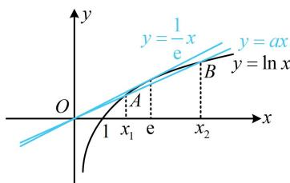

> [!faq]- 《第2节 函数零点小题策略：含参》参考答案
>
> > [!success]- **【答案】** B
>
> > [!note]- **【分析】**
> > 本题未单列分析。
>
> > [!note]- **【解析】**
> > B
> >
> > 解析：先将 $f(x) = 0$ 半分离， $f(x) = 0 \Leftrightarrow ax = \ln x$ ，注意到直线 $y = \frac{1}{e}x$ 与曲线 $y = \ln x$ 相切于 $x = e$ 处，如图，故当 $0 < a < \frac{1}{e}$ 时，直线 $y = ax$ 与曲线 $y = \ln x$ 有 2 个交点，那怎样才能满足题干规定的 $2x_{1} < x_{2}$ 呢？可以这么看，当 $0 < a < \frac{1}{e}$ 时，若 $a$ 增大，则 $x_{1}$ 增大， $x_{2}$ 减小，所以 $\frac{x_{2}}{x_{1}}$ 减小，故只需求出 $a$ 在 $\frac{x_{2}}{x_{1}} = 2$ 时的临界值即可，设此时 $y = ax$ 与 $y = \ln x$ 的两个交点分别为 $A$ 和 $B$ ，如图，因为 $x_{2} = 2x_{1}$ ，且 $A, B$ 都在直线 $y = ax$ 上，所以 $A(x_{1}, ax_{1})$ ， $B(2x_{1}, 2ax_{1})$ ，又 $A, B$ 两点都在曲线 $y = \ln x$ 上，故 $\begin{cases} ax_{1} = \ln x_{1} & ① \\ 2ax_{1} = \ln (2x_{1}) & ② \end{cases}$ ，②-①可得 $ax_{1} = \ln 2$ ，代入①得 $x_{1} = 2$ ，所以 $a = \frac{\ln 2}{2}$ ，由图可知 $a$ 越小， $\frac{x_{2}}{x_{1}}$ 越大，所以 $0 < a < \frac{\ln 2}{2}$ 满足题意.
> >
> > 
