<!-- source-part:1 pages:1-6 -->

## 第2节 函数零点小题策略：含参（★★★☆）

## 内容提要

题干给出带参的函数 $f(x)$ 的零点个数，让求参数 $a$ 的取值范围，这是不是我们在复习过程中经常遇到的一类题？这类题我们有两种常用的处理方法：

1. 全分离: 将方程 $f(x) = 0$ 等价变形成 $a = g(x)$ 的形式, 研究水平直线 $y = a$ 与函数 $y = g(x)$ 图象的交点的个数;

2. 半分离: 当全分离不易或全分离后的函数不好作图时, 常将方程 $f(x) = 0$ 等价变形成 $g(x) = h(x)$ 的形式, 研究 $y = g(x)$ 和 $y = h(x)$ 这两个函数图象的交点个数. 此解法需要让两端的函数都比较好画图.

提醒：本节及后续小节的解析中会反复用到一些常用的切线及其放缩不等式，如 $\mathrm{e}^x\geq x + 1$ ， $\mathrm{e}^x\geq \mathrm{e}x$ ， $\ln x\leq x - 1$ ， $\ln (x + 1)\leq x$ ， $\ln x\leq \frac{1}{\mathrm{e}} x$ 等，这些切线与不等式都不复杂，也有清晰的图形背景（见下图），在后续的解析中，这些切线及不等式都直接使用，不给出证明.

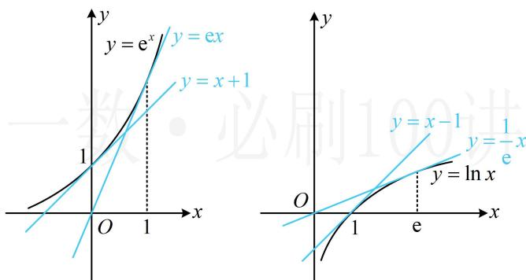

【例 1】已知函数 $f(x)=\ln x-ax+1$ 有两个零点，则实数 a 的取值范围为 \_\_\_\_.

解法1：由题意， $f(x)$ 有两个零点 $\Leftrightarrow$ 方程 $\ln x - ax + 1 = 0$ 有两个实根，

此方程无法直接解，尝试分离作图，看交点，先试试全分离， $\ln x - ax + 1 = 0\Leftrightarrow ax = \ln x + 1\Leftrightarrow a = \frac{\ln x + 1}{x}$

问题等价于直线 $y = a$ 与函数 $y = \frac{\ln x + 1}{x}$ 的图象有两个交点，此图象无法直接作出，先求导研究单调性，

设 $g(x) = \frac{\ln x + 1}{x} (x > 0)$ ，则 $g'(x) = -\frac{\ln x}{x^2}$ ，所以 $g'(x) > 0 \Leftrightarrow 0 < x < 1$ ， $g'(x) < 0 \Leftrightarrow x > 1$

从而 $g(x)$ 在 $(0,1)$ 上 $\nearrow$ ，在 $(1, +\infty)$ 上 $\searrow$ ，且 $g(1) = 1$ ， $\lim_{x\to 0^+}g(x) = -\infty$ ， $\lim_{x\to +\infty}g(x) = 0$

据此可作出 $g(x)$ 的大致图象如图1，由图可知当且仅当 $0 < a < 1$ 时， $f(x)$ 有两个零点，故实数 $a$ 的取值范围为(0,1).

解法2: 对方程 $\ln x - ax + 1 = 0$ 的研究, 解法1用了全分离, 下面试试半分离,

因为 $\ln x - ax + 1 = 0 \Leftrightarrow \ln x = ax - 1$ ，所以问题等价于直线 $y = ax - 1$ 与函数 $y = \ln x$ 的图象有两个交点，而 $y = ax - 1$ 表示过定点 $(0, -1)$ 且斜率为 $a$ 的直线，

注意到函数 $y = \ln x$ 的图象的过点(0, -1)的切线方程为 $y = x - 1$ ，如图2，

当直线 $y = ax - 1$ 位于切线 $y = x - 1$ 和水平线 $y = -1$ 之间时，才会与 $y = \ln x$ 的图象有两个交点，

所以实数 a 的取值范围为 $(0,1)$ .

答案: (0,1)

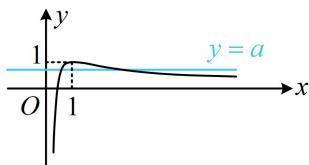  
图1

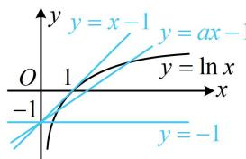  
图2

【变式】已知函数 $f(x)=a\ln x-x+1$ 有两个零点，则实数 a 的取值范围为 \_\_\_\_.

分析：若对方程 $a \ln x - x + 1 = 0$ 用全分离，则可将其变形成 $a = \frac{x - 1}{\ln x} (x \neq 1)$ ，

注意到右侧的函数 $y = \frac{x - 1}{\ln x} (x \neq 1)$ 用初等的方法无法研究当 $x \to 1$ 时，函数值 $y$ 的极限，

所以在高中数学的范畴内，本题用全分离无法求解，从而转向半分离。

解法1：先尝试一种简单的半分离，可将方程 $a\ln x - x + 1 = 0$ 等价变形成 $a\ln x = x - 1$

下面直接讨论 $a$ 取不同值时， $y = a\ln x$ 的图象与直线 $y = x - 1$ 的交点情况，

讨论的分界点是 “a 的正负” 和 “切线” 这两个临界状态， $y = a \ln x$ 与 $y = x - 1$ 相切时， $a = 1$ ，

当 $a < 0$ 时，如图1，两个图象只有一个交点，所以 $f(x)$ 只有1个零点，不合题意；

当 $a = 0$ 时， $f(x) = -x + 1 (x > 0)$ ，所以 $f(x)$ 有1个零点，不合题意；

当 $0 < a < 1$ 时，如图2，两个图象有2个交点，满足题意；

当 $a = 1$ 时，如图3，两个图象只有1个交点，不合题意；

当 $a > 1$ 时，如图4，两个图象有2个交点，满足题意；

综上所述，实数 $a$ 的取值范围为 $(0,1) \cup (1, +\infty)$ .

解法 2: 可以发现解法 1 半分离的方式导致模型较复杂, 但若将 $a$ 也除到右边, 可以使问题的模型转化为直线绕定点旋转, 图形的运动过程更简单,

$f(x) = 0\Leftrightarrow a\ln x - x + 1 = 0\Leftrightarrow a\ln x = x - 1$ ，下面我们再两端同除以 $a$ ，先考虑 $a$ 等于0的情形，

当 $a = 0$ 时，方程 $a\ln x - x + 1 = 0$ 即为 $-x + 1 = 0$ ，解得： $x = 1$ ，不合题意；

当 $a \neq 0$ 时，方程 $a \ln x = x - 1 \Leftrightarrow \ln x = \frac{1}{a} (x - 1)$ ，

所以问题等价于直线 $y = \frac{1}{a} (x - 1)$ 和函数 $y = \ln x$ 的图象有2个交点，

注意到函数 $y = \ln x$ 的图象上(1,0)处的切线方程为 $y = x - 1$ ，如图3，

所以当 $\frac{1}{a} > 0$ 且 $\frac{1}{a} \neq 1$ 时，如图5、图6，直线 $y = \frac{1}{a} (x - 1)$ 和函数 $y = \ln x$ 的图象有2个交点，故 $a > 0$ 且 $a \neq 1$ .

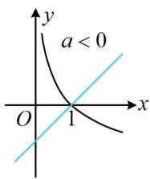  
图1

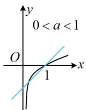  
图2

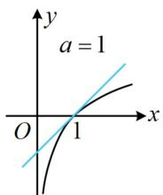  
图3

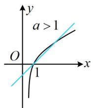  
图4

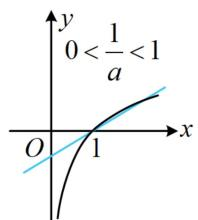  
图5

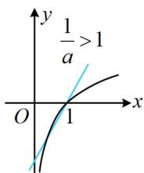  
图6

答案： $(0,1)\cup (1, + \infty)$

【反思】上面两道题，参数 $a$ 在不同的位置，解题过程略有不同，但核心思路始终是分离参数，具体用半分离还是全分离，主要看怎么分离可使函数更好作图分析。在此基础上函数可以变得更复杂，但问题的实质都是分析参数的改变所带来的图形的运动过程。

【例2】若函数 $f(x) = \frac{|x - a|}{\mathrm{e}^x} - 1$ 在 $[-2, +\infty)$ 上有三个零点，则实数 $a$ 的取值范围为 \_\_\_\_. 解析：为了便于作图，考虑通过对方程 $f(x) = 0$ 等价变形，将其中的 $|x - a|$ 和 $\mathrm{e}^x$ 分开，

$f(x) = 0 \Leftrightarrow \frac{|x - a|}{\mathrm{e}^x} = 1 \Leftrightarrow |x - a| = \mathrm{e}^x$ ，所以问题等价于曲线 $y = \mathrm{e}^x (x \geq -2)$ 和曲线 $y = |x - a|$ 有3个交点，当参数 $a$ 发生变化时，曲线 $y = |x - a|$ 会怎样运动？它实际上就是折线 $y = |x|$ 在水平方向上平移，

作出图象如下，两个临界状态如图中的①和②，

对于①，满足直线 y=a-x 过点 $(-2, e^{-2})$ ，
所以 $e^{-2}=a-(-2)$ ，解得： $a=e^{-2}-2$ ；
对于②，满足直线 y=x-a 与 $y=e^{x}$ 的图象相切， $(e^{x})'=e^{x}$ ，
令 $e^{x}=1$ 得：x=0，所以切点为 $(0,1)$ ，代入 y=x-a 可求得 a=-1，
故实数 a 的取值范围为 $[e^{-2}-2,-1)$ .

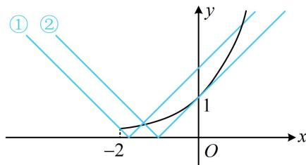

答案: $[\mathrm{e}^{-2} - 2, - 1)$

【反思】本题的模型更复杂，但分析问题的方法仍与前面几道题一样。本题参数在绝对值里面，不易将其全分离，故用的半分离，图形的临界状态是相切和过端点，所以半分离时，需重点关注这两种状态。

【例 3】(2018·新课标 I 卷) 已知函数 $f(x)=\left\{\begin{aligned} &e^{x},x \leq 0 \\ &\ln x,x > 0\end{aligned}\right.$ ， $g(x)=f(x)+x+a$ ，若 $g(x)$ 存在 2 个零点，则 a 的取值范围为（）

A. $[-1,0)$ B. $(0,+\infty)$ C. $[-1,+\infty)$ D. $[1,+\infty)$

解法1：观察发现将 $f(x) + x + a = 0$ 中的 $x + a$ 移到右边，就能作图看交点，故可考虑按此半分离处理， $g(x) = 0 \Leftrightarrow f(x) = -x - a$ ，所以问题等价于函数 $y = f(x)$ 的图象与直线 $y = -x - a$ 有2个交点，如图1，当直线 $y = -x - a$ 位于直线 $l$ 下方（含重合的情形）时，与函数 $y = f(x)$ 的图象有2个交点，故直线在 $y$ 轴上的截距 $-a \leq 1$ ，解得： $a \geq -1$ .

解法2：观察发现方程 $f(x) + x + a = 0$ 中的 $a$ 是孤立的，容易分离出来，故也可考虑全分离，

$g(x)=0\Leftrightarrow-a=f(x)+x$ ，设 $h(x)=f(x)+x$ ，则 $h(x)=\left\{\begin{aligned}\mathrm{e}^{x}+x,x&\leq0\\ \ln x+x,x&>0\end{aligned}\right.$ ， $h(x)$ 在 $(-∞,0]$ ， $(0,+∞)$ 上均↗，函数 $h(x)$ 的草图如图2，由图可知当 $-a\leq1$ 时，直线y=-a与函数 $h(x)$ 的图象有2个交点，所以 $a\geq-1$ 。答案：C

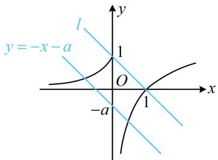  
图1

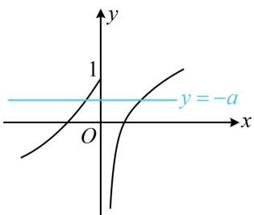  
图2

【反思】即使函数类型变为分段函数，这类题也可以考虑用全分离、半分离来进行求解.

【例 4】若函数 $f(x)=x^{2}\mathrm{e}^{ax}-1$ 有 2 个零点，则实数 a= \_\_\_\_.

解析：直接画 $f(x)$ 的图象不易，考虑将 $f(x) = 0$ 等价变形，以便于作图分析交点，由题意， $f(x) = 0 \Leftrightarrow x^2\mathrm{e}^{ax} - 1 = 0 \Leftrightarrow x^2\mathrm{e}^{ax} = 1 \Leftrightarrow x^2 = \mathrm{e}^{-ax}$ ，

接下来若直接画 $y = x^{2}$ 和 $y = \mathrm{e}^{-ax}$ 的图象来分析交点，则较为麻烦。观察发现若两端取对数，则可使含参的右侧变得很简单，容易分析，故先取对数，而当 $x = 0$ 时不能取对数，下面先考虑这种情况，

当 $x = 0$ 时， $x^{2} = \mathrm{e}^{-ax}$ 不成立；当 $x \neq 0$ 时， $x^{2} = \mathrm{e}^{-ax} \Leftrightarrow \ln x^{2} = \ln \mathrm{e}^{-ax} \Leftrightarrow 2\ln |x| = -ax \Leftrightarrow \ln |x| = -\frac{a}{2} x$

所以问题等价于直线 $y = -\frac{a}{2} x$ 和曲线 $y = \ln |x|$ 有2个交点，可能的情况有 $a = 0$ 或如图所示的两种情况，图中两条切线的方程为 $y = \frac{1}{\mathrm{e}} x$ 和 $y = -\frac{1}{\mathrm{e}} x$ ，所以 $-\frac{a}{2} = \pm \frac{1}{\mathrm{e}}$ ，即 $a = \pm \frac{2}{\mathrm{e}}$ ，故 $a = \pm \frac{2}{\mathrm{e}}$ 或0.

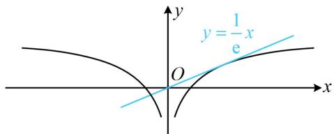

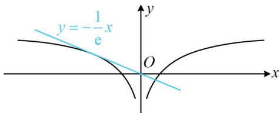

答案： $\pm \frac{2}{\mathrm{e}}$ 或0

【反思】为了便于作图，不仅可以通过移项、同除等方法来分离，对于指数含参的等式，还可以考虑两端取对数将参数从指数部分剥离。在下一节的练习题中，还会用到这一技巧。

![[高中/总复习/教辅/一数常规版2026/第3章 函数与导数/模块5：零点与不等式/第2节 函数零点小题策略：含参/强化训练/强化训练.md]]
