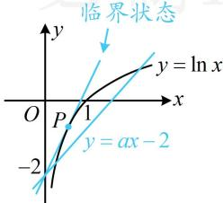

> [!faq]- 《第3节 含参不等式恒成立问题》参考答案
>
> > [!success]- **【答案】** 详见解析
>
> > [!note]- **【分析】**
> > 本题未单列分析。
>
> > [!note]- **【解析】**
> > $(- \infty, e)$
> >
> > 解法1：所给不等式的 $a$ 能完全分离出来，先尝试全分离， $\ln x - ax + 2 > 0 \Leftrightarrow ax < 2 + \ln x \Leftrightarrow a < \frac{2 + \ln x}{x}$ ，所以问题等价于存在 $x > 0$ ，使得 $a < \frac{2 + \ln x}{x}$ ，故只需求右侧的最大值，可构造函数求导分析，设 $f(x) = \frac{2 + \ln x}{x} (x > 0)$ ，则 $f'(x) = -\frac{1 + \ln x}{x^2}$ ，所以 $f'(x) > 0 \Leftrightarrow 0 < x < e^{-1}$ ， $f'(x) < 0 \Leftrightarrow x > e^{-1}$ ，从而 $f(x)$ 在 $(0, e^{-1})$ 上 $\nearrow$ ，在 $(e^{-1}, +\infty)$ 上 $\searrow$ ，故 $f(x)_{\max} = f(e^{-1}) = e$ ，所以 $a < e$ 。
> >
> > 解法2：将 $\ln x - ax + 2 > 0$ 中的 $-ax + 2$ 移至右侧，就能作图分析，故也可尝试半分离， $\ln x - ax + 2 > 0 \Leftrightarrow \ln x > ax - 2$ 如图，临界状态为 $y = ax - 2$ 恰与曲线 $y = \ln x$ 相切的情形，先求此临界状态。直线 $y = ax - 2$ 过定点(0,-2)，所以先求曲线 $y = \ln x$ 过点(0,-2)的切线，不知道切点，故设切点，设切点为 $P(x_0, \ln x_0)$ ，因为 $(\ln x)' = \frac{1}{x}$ ，所以曲线 $y = \ln x$ 在点 $P$ 处的切线方程为 $y - \ln x_0 = \frac{1}{x_0}(x - x_0)$ ，将点(0,-2)代入可得： $-2 - \ln x_0 = \frac{1}{x_0}(0 - x_0)$ ，解得： $x_0 = e^{-1}$ ，所以切线的斜率为 $e$
> >
> > 由图可知，当且仅当 $a < \mathrm{e}$ 时，曲线 $y = \ln x$ 才有位于直线 $y = ax - 2$ 上方的部分，也即存在 $x > 0$ ，使 $\ln x > ax - 2$ 成立，所以 $a < \mathrm{e}$
> >
> > 
