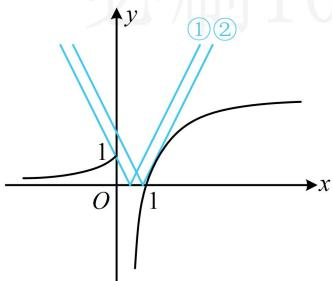

> [!faq]- 《第3节 含参不等式恒成立问题》参考答案
>
> > [!success]- **【答案】** $\left[\frac{1}{2}, \frac{\mathrm{e}\ln 2}{2}\right]$
>
> > [!note]- **【分析】**
> > 本题未单列分析。
>
> > [!note]- **【解析】**
> > 解析：参数 $a$ 在绝对值内，不易分离，考虑直接作图分析，  
> > 作出 $y = f(x)$ 和 $y = 2|x - a|$ 的图象如图，临界状态为图中  
> > 的①和②，
> > - **对于①**：，折线 $y = 2|x - a|$ 左侧部分 $y = 2(a - x)$ 过点 (0,1)，  
> > 所以 $1 = 2(a - 0)$ ，解得： $a = \frac{1}{2}$ ；
> > - **对于②**：， $y = 2|x - a|$ 右侧部分 $y = 2(x - a)$ 与 $y = \mathrm{e}\ln x$ 相切，  
> > 因为 $(\mathrm{e}\ln x)' = \frac{\mathrm{e}}{x}$ ，所以令 $\frac{\mathrm{e}}{x} = 2$ 得： $x = \frac{\mathrm{e}}{2}$ ，  
> > 故切点为 $\left(\frac{\mathrm{e}}{2}, \mathrm{e}\ln \frac{\mathrm{e}}{2}\right)$ ，代入 $y = 2(x - a)$ 可解得： $a = \frac{\mathrm{e}\ln 2}{2}$ ；  
> > 由图可知，当且仅当 $\frac{1}{2} \leq a \leq \frac{\mathrm{e}\ln 2}{2}$ 时， $f(x) \leq 2|x - a|$ 恒成  
> > 立，所以 $a$ 的取值范围为 $\left[\frac{1}{2}, \frac{\mathrm{e}\ln 2}{2}\right]$ .
> >
> > 
