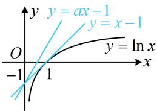

> [!faq]- 《第3节 含参不等式恒成立问题》例题解析
>
> > [!success]- **【答案】** $[1, + \infty)$
>
> > [!note]- **【分析】**
> > 本题未单列分析。
>
> > [!note]- **【解析】**
> > 解法 1：观察发现所给不等式中的参数 a 容易分离出来，故先试试全分离，转化为最值问题来分析，
> >
> > $\ln x - ax + 1 \leq 0 \Leftrightarrow ax \geq 1 + \ln x \Leftrightarrow a \geq \frac{1 + \ln x}{x}$ ，此不等式要恒成立，只需 $a \geq \left(\frac{1 + \ln x}{x}\right)_{\max}$ ，故构造函数求最值，
> >
> > 设 $f(x)=\frac{1+\ln x}{x}(x>0)$ ，则 $f'(x)=-\frac{\ln x}{x^{2}}$ ，所以 $f'(x)>0\Leftrightarrow0<x<1$ ， $f'(x)<0\Leftrightarrow x>1$ ，
> >
> > 从而 $f(x)$ 在 $(0,1)$ 上 $\nearrow$ ，在 $(1, +\infty)$ 上 $\searrow$ ，故 $f(x)_{\max} = f
> > (1) = 1$ ，因为 $a \geq f(x)$ 恒成立，所以 $a \geq 1$
> >
> > 注：此处也可由 $\frac{1 + \ln x}{x} \leq \frac{1 + (x - 1)}{x} = 1$ （当且仅当 $x = 1$ 时取等号）得出 $f(x)$ 的最大值为1.
> >
> > 解法2：只要将 $\ln x - ax + 1 \leq 0$ 中的 $-ax + 1$ 移至右侧，就能作图分析，故也可尝试半分离，
> >
> > $\ln x - ax + 1 \leq 0 \Leftrightarrow \ln x \leq ax - 1$ ，如图， $y = ax - 1$ 是绕点 $(0, -1)$ 旋转的直线，
> >
> > 注意到函数 $y = \ln x$ 的图象过点 $(0, -1)$ 的切线是 y = x - 1，
> >
> > 所以当且仅当 $a \geq 1$ 时， $\ln x \leq ax - 1$ 恒成立.
> >
> >
> > 
