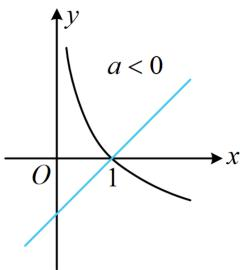
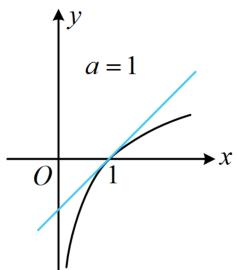
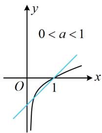
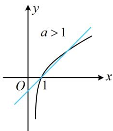
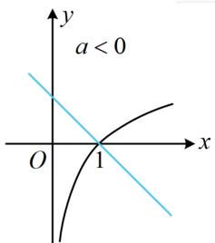
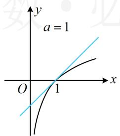
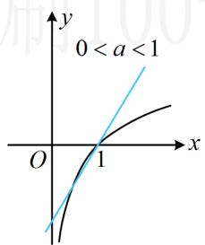
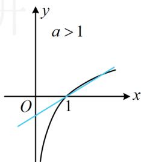

> [!faq]- 《第3节 含参不等式恒成立问题》例题解析
>
> > [!success]- **【答案】** 1
>
> > [!note]- **【分析】**
> > 本题若全分离，则需同除以 $\ln x$ ，但 $\ln x$ 不恒为正，得讨论，所以半分离较好.
>
> > [!note]- **【解析】**
> > 解法 1: $a \ln x - x + 1 \leq 0 \Leftrightarrow a \ln x \leq x - 1$ ，接下来画图分析，a 的正负决定是否需要将 $y = \ln x$ 的图象沿 x 轴翻折，所以 0 是一个讨论的分界点；而当 a > 0 时，改变 a 就是对 $y = \ln x$ 的图象进行不同的纵向伸缩，临界状态是 $y = a \ln x$ 恰与直线 y = x - 1 相切的情形（此时 a = 1），所以 1 是一个讨论的分界点；
> >
> > 当 $a = 0$ 时，不等式 $a\ln x\leq x - 1$ 即为 $0\leq x - 1$ ，故 $x\geq 1$ ，不合题意；
> >
> > 当 a<0 时，如图 1，不等式 $a \ln x \leq x-1$ 在 $(0,1)$ 上不成立，不合题意；
> >
> > 当 $a = 1$ 时，如图2，不等式 $a\ln x\leq x - 1$ 恒成立；
> >
> > 当 0 < a < 1 时，如图 3，不等式 $a \ln x \leq x - 1$ 在 x = 1 的左侧附近有一段不成立，不合题意；
> >
> > 当 $a > 1$ 时，如图4，不等式 $a\ln x \leq x - 1$ 在 $x = 1$ 的右侧附近有一段不成立，不合题意；
> >
> > 综上所述，实数 $a = 1$
> >
> >   
> > 图1
> >
> >   
> > 图2
> >
> >   
> > 图3
> >
> >   
> > 图4
> >
> > 解法 2：在解法 1 中，将原不等式等价变形成 $a \ln x \leq x - 1$ 后，也可进一步将 a 除到右边，转化为直线旋转模型，但需讨论 a 的正负，
> >
> > 当 $a < 0$ 时， $a \ln x \leq x - 1 \Leftrightarrow \ln x \geq \frac{1}{a} (x - 1)$ ，如图5，该不等式在(0,1)上不成立，不合题意；
> >
> > 当 $a = 0$ 时， $a \ln x \leq x - 1$ 即为 $0 \leq x - 1$ ，所以 $x \geq 1$ ，不合题意；
> >
> > 而当 $a > 0$ 时， $a \ln x \leq x - 1 \Leftrightarrow \ln x \leq \frac{1}{a} (x - 1)$ ， $y = \frac{1}{a} (x - 1)$ 表示过定点 $(1,0)$ 且斜率为 $\frac{1}{a}$ 的直线，所以临界状态是 $y = \frac{1}{a} (x - 1)$ 与 $y = \ln x$ 相切的时候，此时 $a = 1$ ，故又讨论 $a$ 与 1 的大小，
> >
> > 当 $a = 1$ 时，如图6， $y = x - 1$ 与 $y = \ln x$ 相切，由图可知不等式 $\ln x \leq x - 1$ 恒成立，满足题意；
> >
> > 当 $0 < a < 1$ 时， $\frac{1}{a} > 1$ ，如图7， $\ln x \leq \frac{1}{a} (x - 1)$ 在 $x = 1$ 左侧附近有一段不成立，不合题意；
> >
> > 当 $a > 1$ 时， $0 < \frac{1}{a} < 1$ ，如图8， $\ln x \leq \frac{1}{a} (x - 1)$ 在 $x = 1$ 右侧附近有一段不成立，不合题意；
> >
> > 综上所述，实数 a=1。
> >
> >   
> > 图5
> >
> >   
> > 图6
> >
> >   
> > 图7
> >
> >   
> > 图8
>
> > [!tip]- **【反思】**
> > - **①**：像 $af(x)$ 这种结构，若 $a$ 在 $(0, +\infty)$ 上变化，则对 $f(x)$ 的图象进行纵向伸缩；若 $a$ 在 $(- \infty, 0)$ 上变化，则先将 $f(x)$ 的图象沿 $x$ 轴翻折，再纵向伸缩；
> > - **②**：半分离常有多种方向，一般研究动直线比动曲线简单.
>
> > [!tip]- **【总结】**
> > 从上面两道题可以看到，无论参数在哪个位置，全分离、半分离都是解决含参不等式问题的基本方法.
