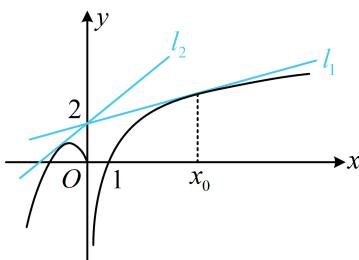

> [!faq]- 《第3节 含参不等式恒成立问题》例题解析
>
> > [!success]- **【答案】** $\left[\frac{2}{\mathrm{e}^2}, 2\sqrt{2} - 2\right]$
>
> > [!note]- **【分析】**
> > 本题未单列分析。
>
> > [!note]- **【解析】**
> > 解法 1: $f(x)$ 为分段函数, 可以考虑分两段分别研究不等式 $f(x) \leq ax + 2$ ,
> > - **①**：当 $x \leq 0$ 时， $f(x) \leq ax + 2 \Leftrightarrow ax \geq -x^{2} - 2x - 2$ ；两端同除以 x 即可全分离，先考虑 x = 0 的情形，
> >
> > 当 x=0 时，不等式 $ax \geq -x^{2}-2x-2$ 对任意的 $a \in R$ 都成立；
> >
> > 当 $x < 0$ 时， $ax \geq -x^2 - 2x - 2 \Leftrightarrow a \leq -x + \frac{2}{-x} - 2$ ，因为 $-x + \frac{2}{-x} - 2 \geq 2\sqrt{(-x) \cdot \frac{2}{-x}} - 2 = 2\sqrt{2} - 2$ ，
> >
> > 当且仅当 $x = -\sqrt{2}$ 时等号成立，所以 $\left(-x + \frac{2}{-x} - 2\right)_{\min} = 2\sqrt{2} - 2$ ，故 $a \leq 2\sqrt{2} - 2$
> > - **②**：当 $x > 0$ 时， $f(x) \leq ax + 2$ 即为 $2\ln x \leq ax + 2$ ，也即 $a \geq \frac{2\ln x - 2}{x}$ ，
> >
> > 设 $g(x) = \frac{2\ln x - 2}{x} (x > 0)$ ，则 $g'(x) = \frac{2(2 - \ln x)}{x^2}$ ，所以 $g'(x) > 0 \Leftrightarrow 0 < x < \mathsf{e}^2$ ， $g'(x) < 0 \Leftrightarrow x > \mathsf{e}^2$ ，
> >
> > 从而 $g(x)$ 在 $(0, \mathrm{e}^2)$ 上 $\nearrow$ ，在 $(\mathrm{e}^2, +\infty)$ 上 $\searrow$ ，故 $g(x)_{\max} = g(\mathrm{e}^2) = \frac{2}{\mathrm{e}^2}$ ，因为 $a \geq g(x)$ 恒成立，所以 $a \geq \frac{2}{\mathrm{e}^2}$ ；综上所述，实数 $a$ 的取值范围是 $\left[\frac{2}{\mathrm{e}^2}, 2\sqrt{2} - 2\right]$ .
> >
> > 解法 2: $f(x) \leq ax + 2$ 的左右两侧的函数图象都好画, 故也可保持这种半分离状态, 直接作图分析,
> >
> > 如图，当且仅当直线 $y = ax + 2$ 从 $l_{1}$ 绕点(0,2)逆时针旋转至 $l_{2}$ 时，不等式 $f(x) \leq ax + 2$ 恒成立，
> >
> > $$
> > l _ {1}: y = a _ {1} x + 2
> > $$
> >
> > $$
> > l _ {2}: y = a _ {2} x + 2
> > $$
> >
> > $$
> > l _ {1}
> > $$
> >
> > 直线 $l_{1}$ 与 $y=2\ln x$ 相切，设切点为 $(x_{0},2\ln x_{0})$ ，因为 $(2\ln x)'=\frac{2}{x}$ ，所以 $\left\{\begin{aligned}\frac{2}{x_{0}}&=a_{1}\\ 2\ln x_{0}&=a_{1}x_{0}+2\end{aligned}\right.$ ，解得： $a_{1}=\frac{2}{e^{2}}$ ；
> >
> > $$
> > a _ {1}
> > $$
> >
> > 再求 $l_{2}$ 的斜率 $a_{2}$ ， $l_{2}$ 与曲线 $y=-x^{2}-2x(x\leq0)$ 相切， $\left\{\begin{aligned}y=a_{2}x+2\\ y=-x^{2}-2x\end{aligned}\right.\Rightarrow x^{2}+(a_{2}+2)x+2=0$ ，
> >
> > 判别式 $\Delta = (a_{2} + 2)^{2} - 8 = 0\Rightarrow a_{2} = 2\sqrt{2} -2$ 或 $-2\sqrt{2} -2$ （舍去），
> >
> > (过点 $(0,2)$ 能作抛物线 $y=-x^{2}-2x$ 的两条切线，图中的 $l_{2}$ 是
> >
> > $$
> > - 2 \sqrt {2} - 2
> > $$
> >
> > 由图可知，当且仅当 $a \in \left[\frac{2}{\mathrm{e}^2}, 2\sqrt{2} - 2\right]$ 时， $f(x) \leq ax + 2$ 恒成立.
> >
> > 
>
> > [!tip]- **【反思】**
> > 全分离重在等价变形和求最值，半分离重在分析图象的运动过程，求解临界状态.
