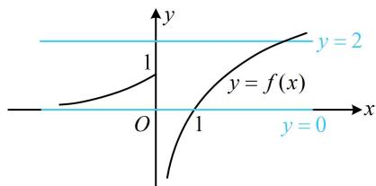

> [!faq]- 《第1节 复合函数方程问题》参考答案
>
> > [!success]- **【答案】** 2
>
> > [!note]- **【分析】**
> > 本题未单列分析。
>
> > [!note]- **【解析】**
> > 解析：设 $t = f(x)$ ，则 $f(f(x)) - 1 = 0$ 即为 $f(t) - 1 = 0$
> >
> > 也即 $f(t) = 1$ ，观察解析式可得 $f(t) = 1$ 在两段都很好解，所以下面通过讨论求解此方程，
> >
> > 当 $t \leq 0$ 时， $f(t) = 2^t = 1 \Rightarrow t = 0$ ；
> >
> > 当 $t > 0$ 时， $f(t) = \log_2 t = 1 \Rightarrow t = 2$ ；
> >
> > 故方程 $f(t) = 1$ 的解为 $t = 0$ 或2，故 $f(x) = 0$ 或 $f(x) = 2$ ，
> >
> > 要再讨论 $x$ ，代入解析式求解上述两个方程吗？不用，画图看交点更简单，
> >
> > 函数 $y = f(x)$ 的大致图象如图，直线 $y = 0$ 和 $y = 2$ 各与该图象有1个交点，所以 $y = f(f(x)) - 1$ 的零点个数为2.
> >
> > 
