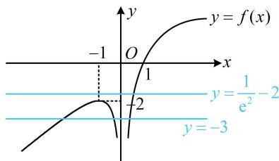

> [!faq]- 《第1节 复合函数方程问题》参考答案
>
> > [!success]- **【答案】** B
>
> > [!note]- **【分析】**
> > 本题未单列分析。
>
> > [!note]- **【解析】**
> > B
> > 解析： $g(x)=0\Leftrightarrow f(f(x)+2)+2=0$ 设 $t = f(x) + 2$ ，则 $f(t) + 2 = 0$ ，所以 $f(t) = -2$ ，
> > 要由此解 t，可通过讨论 t 与 0 的大小，代入解析式，
> > 当 t < 0 时， $f(t) = t + \frac{1}{t}$ ，所以 $f(t) = -2$ 即为 $t + \frac{1}{t} = -2$ ，
> > 解得：t = -1，满足 t < 0；
> > 当 t > 0 时， $f(t) = \ln t$ ，所以 $f(t) = -2$ 即为 $\ln t = -2$ ，
> > 解得： $t=\frac{1}{e^{2}}$ ，满足 t>0；
> > 求出了 t，再代回 $t=f(x)+2$ ，看看 x 有几个解，
> > 所以 $f(x)+2=-1$ 或 $f(x)+2=\frac{1}{e^{2}}$ 故 $f(x)=-3$ 或 $f(x)=\frac{1}{e^{2}}-2$ 要研究 $g(x)$ 的零点个数，可画图看直线 y = -3 和 $y = \frac{1}{e^{2}} - 2$ 与 $f(x)$ 的图象的交点个数，
> > 如图，y = -3 与 f(x) 的图象有 3 个交点， $y = \frac{1}{e^{2}} - 2$ 与 $f(x)$ 的图象有 1 个交点，故 $g(x)$ 有 4 个零点.
> >
> > 
