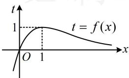
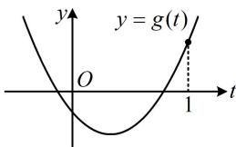
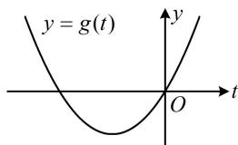

> [!faq]- 《第1节 复合函数方程问题》参考答案
>
> > [!success]- **【答案】** $\left(1, \frac{3}{2}\right)$
>
> > [!note]- **【分析】**
> > 本题未单列分析。
>
> > [!note]- **【解析】**
> > 解析：所给方程较复杂，观察发现含 $x$ 的部分以 $f(x)$ 的形式整体出现，可考虑将 $f(x)$ 换元成 $t$ ，使该方程简化，
> >
> > 令 $t = f(x)$ ，则方程 $f(x) + \frac{1}{f(x) + 1} = a$ 即为 $t + \frac{1}{t + 1} = a$ ，即 $t(t + 1) + 1 = a(t + 1)$ ，化简得： $t^2 +(1 - a)t + 1 - a = 0$ ①，
> >
> > 怎样能使原方程有3个不相等的实数解？注意到我们由①解出 $t$ 后，要代回 $t = f(x)$ 去研究 $x$ 的解的情况，那我们不妨先分析函数 $f(x)$ ，看看要使 $t = f(x)$ 有3个不相等的实数解，需要什么样的 $t$ ，
> >
> > 由题意， $f(x) = x\mathrm{e}^{1 - x}$ ，所以 $f^{\prime}(x) = \mathrm{e}^{1 - x} + x\cdot (-\mathrm{e}^{1 - x})$
> >
> > $= (1 - x)\mathrm{e}^{1 - x}$ ，从而 $f^{\prime}(x) > 0\Leftrightarrow x <   1$ ， $f^{\prime}(x) <   0\Leftrightarrow x > 1$
> >
> > 故 $f(x)$ 在 $(- \infty, 1)$ 上 $\nearrow$ ，在 $(1, +\infty)$ 上 $\searrow$ ，
> >
> > 所以 $f(x)_{\max}=f(1)=1$ ，
> >
> > 又当 $x \to -\infty$ 时， $\mathrm{e}^{1 - x} \to +\infty$ ， $f(x) = x\mathrm{e}^{1 - x} \to -\infty$
> >
> > 当 $x \to +\infty$ 时， $f(x) = x \mathrm{e}^{1 - x} = \frac{\mathrm{e}x}{\mathrm{e}^x} \to 0$ ， $f(x)$ 的草图如图1，
> >
> >   
> > 图1
> >
> > 观察发现一条水平直线与 $f(x)$ 图象的交点个数只可能是0,1,2,故要使 $t = f(x)$ 有3个实数解,至少需要2条水平直线,而方程①最多也只能有2个不相等的实数解,于是方程①应恰有两个不相等的实根,这两根分布在哪里呢?我们发现有一根必须在(0,1)上,另一根可以为1,也可以在 $(-\infty,0]$ 上,故据此讨论,
> >
> > (i)当方程①有一根恰好为1时，
> >
> > 将 $t = 1$ 代入①得 $1 + 1 - a + 1 - a = 0$ ，解得： $a = \frac{3}{2}$
> >
> > 此时方程①即为 $t^2 - \frac{1}{2} t - \frac{1}{2} = 0$ ，也即 $2t^2 - t - 1 = 0$
> >
> > 所以 $t = 1$ 或 $-\frac{1}{2}$ ，另一根为 $-\frac{1}{2}$ ，不在(0,1)上，不合题意；
> >
> > (ii)当方程①的两根分别在 $(- \infty, 0]$ 和 $(0,1)$ 上时，
> >
> > 设 $g(t) = t^2 + (1 - a)t + 1 - a$ ，此时要按图2列出不等式组 $\left\{ \begin{array}{ll} \Delta = (1 - a)^2 - 4(1 - a) > 0 & \text{(确保方程①有两个不相等实根)} \\ g(0) = 1 - a \leq 0 & \text{(保证} t_1 \leq 0) \\ g(1) = 3 - 2a > 0 & \text{(保证} 0 < t_2 < 1) \end{array} \right.$ 吗？务必注意，
> >
> > 图3的情况（有一根恰好为0，另一根小于0）也是满足上述不等式组的，但它不满足题意，所以要单独考虑这种情况，
> >
> >   
> > 图2
> >
> >   
> > 图3
> >
> > 若方程①恰有一根为0，则将 $t = 0$ 代入①得 $1 - a = 0$
> >
> > 所以 a=1 ，此时方程①即为 $t^{2}=0$ ，解得：t=0 ，
> >
> > 所以方程①只有唯一的实根，不合题意；
> >
> > 若方程①的两根分别在 $(- \infty, 0)$ 和 $(0,1)$ 上，则如图2，
> >
> > 应有 $\left\{ \begin{array}{l} g(0) = 1 - a < 0 (\text{保证} t_1 < 0) \\ g(1) = 3 - 2a > 0 (\text{保证} 0 < t_2 < 1) \end{array} \right.$ ，解得： $1 < a < \frac{3}{2}$ ；
> >
> > 综上所述，实数 $a$ 的取值范围为 $\left(1, \frac{3}{2}\right)$ .
