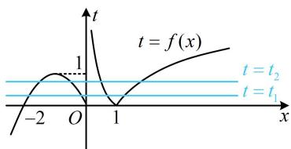
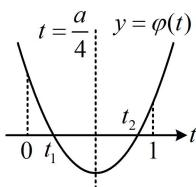

> [!faq]- 《第1节 复合函数方程问题》参考答案
>
> > [!success]- **【答案】** $(2\sqrt{2},3)$
>
> > [!note]- **【分析】**
> > 本题未单列分析。
>
> > [!note]- **【解析】**
> > 解析：由题意，方程 $2f^{2}(x) + 1 = af(x)$ 有8个实根，
> >
> > $$
> > 2 f ^ {2} (x) + 1 = a f (x) \Leftrightarrow 2 f ^ {2} (x) - a f (x) + 1 = 0 \quad ①,
> > $$
> >
> > 所以问题等价于关于 $x$ 的方程①有8个实数解，
> >
> > 因为含 $x$ 的部分是 $f(x)$ 的整体形式，所以将 $f(x)$ 换元，
> >
> > 设 $t = f(x)$ ，则式①为 $2t^{2} - at + 1 = 0$ ， $t = f(x)$ 的图象如图1，一条水平线与该图象的交点个数可能为1，2，3，4，怎样能使方程①有8个解？只能是方程 $2t^{2} - at + 1 = 0$ 有2根 $t_{1}$ ， $t_{2}$ ，且 $t_{1} = f(x)$ 和 $t_{2} = f(x)$ 都有4个解，
> >
> > 所以 $t_1$ ， $t_2$ 都位于(0,1)上，故二次函数 $\varphi (t) = 2t^2 - at + 1$ 的图象应如图2所示，所以 $\left\{ \begin{array}{ll}\Delta = a^2 -8 > 0\\ 0 <   \frac{a}{4} <  1\\ \varphi (1) = 3 - a > 0\\ \varphi (0) = 1 > 0 \end{array} \right.$
> >
> > 解得： $2\sqrt{2} < a < 3$
> >
> >   
> > 图1
> >
> >   
> > 图2
