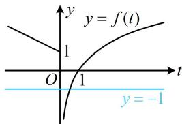
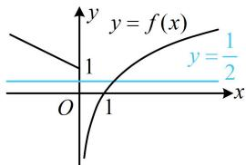
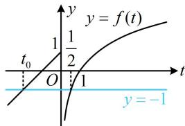
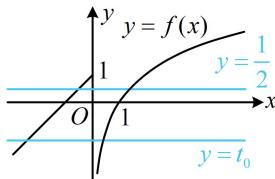

> [!faq]- 《第1节 复合函数方程问题》参考答案
>
> > [!success]- **【答案】** $(0, + \infty)$
>
> > [!note]- **【分析】**
> > 本题未单列分析。
>
> > [!note]- **【解析】**
> > 解析：设 $t = f(x)$ ，则 $f(f(x)) + 1 = 0$ 可化为 $f(t) = -1$
> >
> > 可由直线 $y = -1$ 与 $y = f(t)$ 的图象交点的横坐标来看此方程的解的情况，所以画图，需讨论 $a$ 的正负，
> >
> > 当 $a \leq 0$ 时，如图1， $f(t) = -1 \Leftrightarrow \log_2 t = -1 \Leftrightarrow t = \frac{1}{2}$ ，
> >
> > 所以 $f(x) = \frac{1}{2}$ ，如图2，直线 $y = \frac{1}{2}$ 与 $y = f(x)$ 的图象只有1个交点，从而 $y = f(f(x)) + 1$ 仅有1个零点，不合题意；当 $a > 0$ 时，如图3，直线 $y = -1$ 与 $y = f(t)$ 的图象有2个交点，其横坐标分别为 $t_0(t_0 < 0)$ 和 $\frac{1}{2}$ ，
> >
> > 如图4， $y = \frac{1}{2}$ 与 $y = f(x)$ 的图象有2个交点， $y = t_0$ 与 $y = f(x)$ 的图象也有2个交点，
> >
> > 故方程 $f(x) = t_0$ 和 $f(x) = \frac{1}{2}$ 共有4个实数解，满足题意；
> >
> > 综上所述，实数 a 的取值范围是 $(0, +\infty)$ .
> >
> >   
> > 图1
> >
> > 
> >
> >   
> > 图3
> >
> > 图2  
> >   
> > 图4
