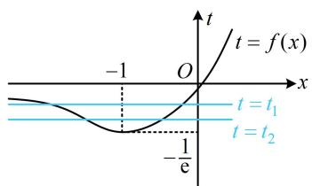
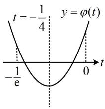

> [!faq]- 《第1节 复合函数方程问题》参考答案
>
> > [!success]- **【答案】** $\left(-\frac{1}{8}, \frac{2 - e}{e^2}\right)$
>
> > [!note]- **【分析】**
> > 本题未单列分析。
>
> > [!note]- **【解析】**
> > 解析：题设条件的变形方向比较难想，其实形式上隐藏着“猫腻”，如果两端同乘以 $x^{2}$ ，就可发现变为了复合结构，
> >
> > $$
> > 2 \mathrm{e} ^ {2 x} = \frac {a}{x ^ {2}} - \frac {\mathrm{e} ^ {x}}{x} \Leftrightarrow 2 x ^ {2} \mathrm{e} ^ {2 x} = a - x \mathrm{e} ^ {x} (x \neq 0)
> > $$
> >
> > $$
> > \Leftrightarrow 2 (x \mathrm{e} ^ {x}) ^ {2} + x \mathrm{e} ^ {x} - a = 0 (x \neq 0)
> > $$
> >
> > 含 $x$ 的部分都是 $x \mathrm{e}^{x}$ 这一整体结构, 所以将 $x \mathrm{e}^{x}$ 换元,
> >
> > 设 $t = x\mathrm{e}^x$ ，则 $2t^{2} + t - a = 0$ ，等会儿要把解得的 $t$ 用来和函数 $y = x\mathrm{e}^x$ 的图象看交点，故先研究这个函数，
> >
> > 设 $f(x) = x\mathrm{e}^{x}(x\in \mathbf{R})$ ，则 $f^{\prime}(x) = (x + 1)\mathrm{e}^{x}$
> >
> > 所以 $f'(x)>0\Leftrightarrow x>-1$ ， $f'(x)<0\Leftrightarrow x<-1$ ，
> >
> > 从而 $f(x)$ 在 $(- \infty, -1)$ 上 $\searrow$ ，在 $(-1, +\infty)$ 上 $\nearrow$
> >
> > $$
> > \lim _ {x \to + \infty} f (x) = + \infty , \quad \lim _ {x \to - \infty} f (x) = 0, \quad f (- 1) = - \frac {1}{\mathrm{e}}
> > $$
> >
> > 所以 $f(x)$ 的大致图象如图1，由图可知一条水平直线与 $f(x)$ 的图象可能有0，1，2个交点，
> >
> > 故要使原方程有4根，方程 $2t^{2} + t - a = 0$ 应有2根 $t_1,t_2$
> >
> > 且 $t_1 = f(x)$ 和 $t_2 = f(x)$ 都有2根，故 $t_1, t_2$ 都在 $\left(-\frac{1}{\mathrm{e}}, 0\right)$ 上，
> >
> > 所以二次函数 $\varphi(t) = 2t^2 + t - a$ 的大致图象如图2，
> >
> > 故 $\left\{\begin{aligned}\Delta&=1+8a>0\\\varphi\left(-\frac{1}{e}\right)&=\frac{2}{e^{2}}-\frac{1}{e}-a>0,\\ \varphi(0)&=-a>0\end{aligned}\right.$ ，解得： $-\frac{1}{8}<a<\frac{2-e}{e^{2}}.$
> >
> >   
> > 图1
> >
> >   
> > 图2
>
> > [!tip]- **【反思】**
> > 本题难度颇高，其复合结构是隐藏的．所以对于复杂的形式，我们要注意观察各部分的结构联系，找到变形的思路.
> >
> > 一数·必刷100讲
