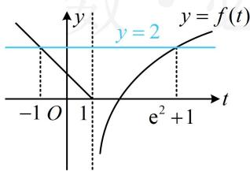
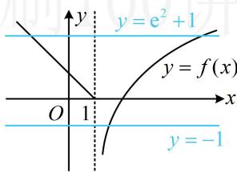

> [!faq]- 《第1节 复合函数方程问题》例题解析
>
> > [!success]- **【答案】** C
>
> > [!note]- **【分析】**
> > 本题未单列分析。
>
> > [!note]- **【解析】**
> > 解析：在零点问题中，看到复合函数结构 $f(f(x))$ ，一般会将内层换元成 $t$ ，先解 $t$ ，再解 $x$ ，由题意， $g(x) = 0 \Leftrightarrow f(f(x)) = 2$ ，设 $t = f(x)$ ，则 $f(t) = 2$ ，通过讨论 $t$ 与 1 的大小，代入解析式求解上述方程可行，但画直线 $y = 2$ 与 $y = f(t)$ 的图象来看更简单，如图 1， $f(t) = 2$ 的解是 $t = -1$ 或 $e^2 + 1$ ，求出了 $t$ ，再代回 $t = f(x)$ ，看看 $x$ 有几个解，将 $t = -1$ 和 $t = e^2 + 1$ 代入 $t = f(x)$ 可得 $-1 = f(x)$ ， $e^2 + 1 = f(x)$ ，如图 2， $g(x)$ 的零点个数即为直线 $y = -1$ 和 $y = e^2 + 1$ 与 $y = f(x)$ 图象的交点个数，由图可知交点个数为 3，故选 C.
> >
> >   
> > 图1
> >
> >   
> > 图2
