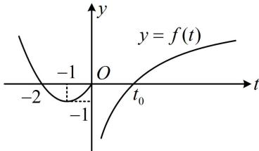
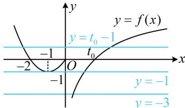

> [!faq]- 《第1节 复合函数方程问题》例题解析
>
> > [!success]- **【答案】** D
>
> > [!note]- **【分析】**
> > 本题未单列分析。
>
> > [!note]- **【解析】**
> > 解析：$f(f(x)+1)$ 仍是双层结构，研究零点时可将内层换元成 $t$ ，化整为零，先解 $t$ ，再解 $x$ ，设 $t=f(x)+1$ ，则 $f(f(x)+1)=0$ 即为 $f(t)=0$ ，下面画图看 $f(t)=0$ 的解的情况，当 $t>0$ 时， $f(t)=\ln t-\frac{1}{t}$ ，所以 $f'(t)=\frac{1}{t}+\frac{1}{t^2}>0$ ，故 $f(t)$ 在 $(0,+\infty)$ 上 $\nearrow$ ，因为 $f
> > (1)=-1<0$ ， $f
> > (2)=\ln 2-\frac{1}{2}>0$ ，所以 $f(t)$ 在 $(0,+\infty)$ 上有唯一的零点 $t_0$ ，且 $t_0\in(1,2)$ ，又 $\lim_{t\to 0^{+}}f(t)=-\infty$ ， $\lim_{t\to+\infty}f(t)=+\infty$ ，所以函数 $y=f(t)$ 的大致图象如图1，由图可知 $f(t)=0$ 有 $t=-2$ ， $0$ ， $t_0$ 三个解，下面将这三个解代回 $t=f(x)+1$ 再看 $x$ 的解的个数所以， $2=f(x)+1$ 或 $0=f(x)+1$ 或 $t=f(x)+1$ 。从而 $f(x)=2$ 或 $f(x)=1$ 或 $f(x)=t=1$ 。
> >
> > $$
> > - 2 = f (x) + 1
> > $$
> >
> > $$
> > 0 = f (x) + 1
> > $$
> >
> > $$
> > t _ {0} = f (x) + 1
> > $$
> >
> > $$
> > f (x) = t _ {0} - 1
> > $$
> >
> > 故只需看直线 $y = -3$ ， $y = -1$ ， $y = t_0 - 1$ 和函数 $y = f(x)$ 的图象共有几个交点，如图2，上述三条水平的直线与函数 $y = f(x)$ 的图象共有5个交点，故选D.
> >
> >
> >   
> > 图1
> >
> >   
> > 图2
>
> > [!tip]- **【总结】**
> > 研究 $y = f(g(x))$ 的零点，同样可类似例 1，设 $t = g(x)$ ，先由 $f(t) = 0$ 求出 t，再代回 $t = g(x)$ 解 x.
