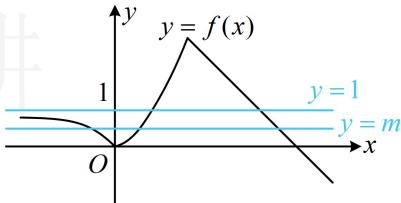

> [!faq]- 《第1节 复合函数方程问题》例题解析
>
> > [!success]- **【答案】** B
>
> > [!note]- **【分析】**
> > 本题未单列分析。
>
> > [!note]- **【解析】**
> > 解析：观察发现若将 $f(x)$ 看作一个整体，则原方程可分解因式，故先按此化简原方程，
> >
> > 由题意， $[f(x)]^2 -(m + 1)f(x) + m = 0\Leftrightarrow [f(x) - 1][f(x) - m] = 0$ ，所以 $f(x) = 1$ 或 $f(x) = m$
> >
> > 原方程有5根等价于上述两个方程共有5根，即直线 $y = 1$ 和 $y = m$ 与 $f(x)$ 的图象共有5个交点，如图，直线 $y = 1$ 与 $f(x)$ 的图象有2个交点，所以 $y = m$ 与 $f(x)$ 的图象应有3个交点，故 $0 < m < 1$
> >
> >
> > 
>
> > [!tip]- **【反思】**
> > 本题研究 5 根的组成方式是求解 m 范围关键，由于 $f(x)=1$ 有 2 根，所以 $f(x)=m$ 必有 3 根，从而据此求得 m 的取值范围.
