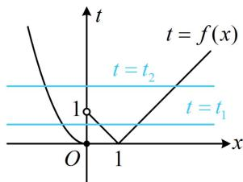
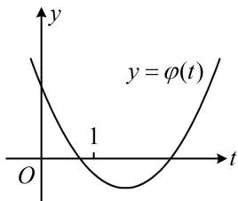
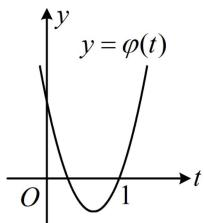

> [!faq]- 《第1节 复合函数方程问题》例题解析
>
> > [!success]- **【答案】** A
>
> > [!note]- **【分析】**
> > 本题未单列分析。
>
> > [!note]- **【解析】**
> > 解析：$g(x) = 0 \Leftrightarrow f^{2}(x) + kf(x) + 2 = 0$ ，此方程含 $x$ 的部分是 $f(x)$ 这一整体结构，可考虑将其换元成 $t$ ，设 $t = f(x)$ ，则 $t^2 + kt + 2 = 0$ ，不易分解因式，于是直接分析该方程根的分布情况，
> >
> > 函数 $t = f(x)$ 的大致图象如图1，由图可知，当 $t$ 变化时，方程 $t = f(x)$ 的解的个数可能为0，2，3，所以要使 $g(x)$ 有5个零点，方程 $t^2 +kt + 2 = 0$ 应有2个解 $t_1$ ， $t_2$ 且 $t_1 = f(x)$ 和 $t_2 = f(x)$ 分别有3个，2个解，故 $t_1\in (0,1)$ ， $t_2\in [1, + \infty)\cup \{0\}$ 注意到0不是方程 $t^2 +kt + 2 = 0$ 的解，所以只能 $t_1\in (0,1)$ ， $t_2\in [1, + \infty)$
> >
> > 接下来就是一元二次方程根的分布问题了，可根据根的分布，画出对应的二次函数可能的图象，二次函数 $\varphi(t) = t^2 + kt + 2$ 的大致图象只能如图2或图3，
> >
> > 若为图2，则 $\left\{ \begin{array}{l} \varphi(0) = 2 > 0 \\ \varphi
> >
> >
> >   
> > 图1
> >
> >   
> > 图2
> >
> >   
> > 图3
>
> > [!tip]- **【反思】**
> > 与例 2 相比, 本题的核心仍是基于研究 5 根的组成方式来求 $m$ 的范围, 不同之处在于令 $t = f(x)$ 后所得方程 $t^2 + kt + 2 = 0$ 不好解, 故画图分析 $t = f(x)$ 可能的解的个数, 进而发现 5 根的组成方式只能为 $3 + 2$ .
