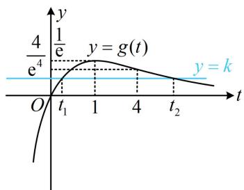
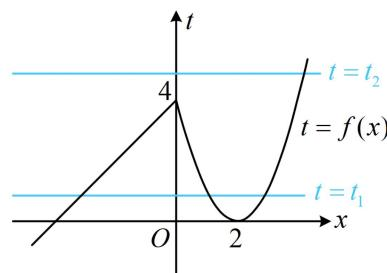

> [!faq]- 《第1节 复合函数方程问题》例题解析
>
> > [!success]- **【答案】** $\left(0,\frac{4}{\mathrm{e}^4}\right)$
>
> > [!note]- **【分析】**
> > 本题未单列分析。
>
> > [!note]- **【解析】**
> > 解析：设 $t = f(x)$ ，则 $g(f(x)) - k = 0$ 即为 $g(t) = k$ ，此方程无法直接解，考虑画图来看解的情况，由题意， $g'(t) = \frac{1 - t}{\mathrm{e}^t}$ ，所以 $g'(t) > 0 \Leftrightarrow t < 1$ ， $g'(t) < 0 \Leftrightarrow t > 1$ ，故 $g(t)$ 在 $(- \infty, 1)$ 上 $\nearrow$ ，在 $(1, +\infty)$ 上 $\searrow$ ，又 $g
> >
> >
> >   
> > 图1
> >
> >   
> > 图2
>
> > [!tip]- **【反思】**
> > 本题令 $t = f(x)$ 后所得的方程 $g(t) - k = 0$ 不再是一元二次方程，但是你看，解题思路还是大同小异吧？先分析 $g(t) = k$ 的根的分布情况，再研究 $t = f(x)$ 的解的个数。结合上面的几道题，相信你已摸清本节题型的思
> >
> > 考流程.
