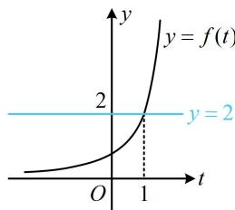
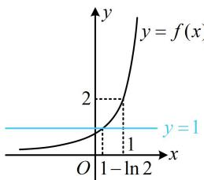

> [!faq]- 《第2节 复合函数不等式问题》参考答案
>
> > [!success]- **【答案】** $(- \infty, 1 - \ln 2)$
>
> > [!note]- **【分析】**
> > 本题未单列分析。
>
> > [!note]- **【解析】**
> > 解析：$f(f(x)) < 2$ 为双层复合结构的不等式，可考虑通过将 $f(x)$ 换元，化整为零，来简化该不等式，
> >
> > 设 $t = f(x)$ ，则 $f(f(x)) < 2$ 即为 $f(t) < 2$
> >
> > 函数 $f(t)$ 的图象好画，故画图来看不等式 $f(t) < 2$ 的解，
> >
> > 如图1，由图可知 $f(t) < 2 \Leftrightarrow t < 1$ ，所以 $f(x) < 1$
> >
> > 同样的方法，再结合图象来看不等式 $f(x) < 1$ 的解，
> >
> > 如图2，联立 $\left\{ \begin{array}{l} y = 1 \\ y = 2\mathrm{e}^{x - 1} \end{array} \right.$ 解得： $x = 1 - \ln 2$
> >
> > 由图2可知不等式 $f(x) < 1$ 的解集为 $(- \infty, 1 - \ln 2)$ .
> >
> >   
> > 图1
> >
> >   
> > 图2
