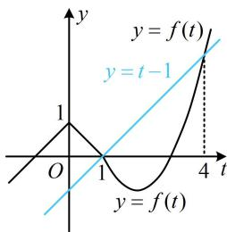
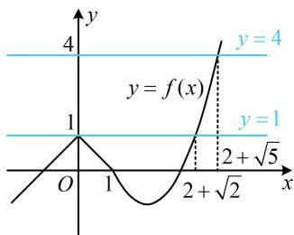

> [!faq]- 《第2节 复合函数不等式问题》参考答案
>
> > [!success]- **【答案】** $\{0\} \cup [2 + \sqrt{2}, 2 + \sqrt{5}]$
>
> > [!note]- **【分析】**
> > 本题未单列分析。
>
> > [!note]- **【解析】**
> > 解析：$f(f(x)) - f(x) + 1$ 是复合结构，它由 $y = f(t) - t + 1$ 和 $t = f(x)$ 复合而成，所以先将 $f(x)$ 换元，化整为零，设 $t = f(x)$ ，则 $f(f(x)) - f(x) + 1 \leq 0$ 即为 $f(t) - t + 1 \leq 0$ ，
> >
> > 也即 $f(t) \leq t - 1$ ，通过讨论 $t$ 代解析式求解可行，但画出
> >
> > $y = f(t)$ 和 y = t - 1 的图象来看更简单，
> >
> > 如图1， $\left\{ \begin{array}{l}y = t - 1\\ y = t^2 -4t + 3 \end{array} \right.\Rightarrow t = 1$ 或4，
> >
> > 由图可知 $f(t)\leq t - 1\Leftrightarrow 1\leq t\leq 4$ ，所以 $1\leq f(x)\leq 4$
> >
> > 如图2， $\left\{ \begin{array}{l}y = 1\\ y = x^{2} - 4x + 3 \end{array} \right.\Rightarrow x = 2 + \sqrt{2}$ 或 $2 - \sqrt{2}$
> >
> > $\left\{ \begin{array}{l} y = 4 \\ y = x^{2} - 4x + 3 \end{array} \right. \Rightarrow x = 2 + \sqrt{5}$ 或 $2 - \sqrt{5}$ ,
> >
> > 由图可知， $1\leq f(x)\leq 4$ 的解集为 $\{0\} \cup [2 + \sqrt{2},2 + \sqrt{5} ]$
> >
> >   
> > 图1
> >
> >   
> > 图2
