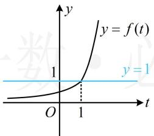
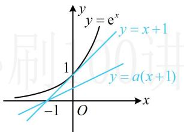

> [!faq]- 《第2节 复合函数不等式问题》参考答案
>
> > [!success]- **【答案】** [0,1]
>
> > [!note]- **【分析】**
> > 本题未单列分析。
>
> > [!note]- **【解析】**
> > 解析：先将 $f(g(x)) \geq 1$ 内层的 $g(x)$ 换元，化整为零，
> >
> > 设 $t = g(x)$ ，则 $f(g(x))\geq 1$ 即为 $f(t)\geq 1$
> >
> > 函数 $y = f(t)$ 的图象好画，可画图来解不等式 $f(t) \geq 1$ ，
> >
> > 如图1，由图可知 $f(t)\geq 1\Leftrightarrow t\geq 1$ ，所以 $g(x)\geq 1$
> >
> > 即 $\mathrm{e}^x - a(x + 1) + 1 \geq 1$ ，所以 $\mathrm{e}^x \geq a(x + 1)$
> >
> > 如图2，注意到曲线 $y = \mathrm{e}^{x}$ 和直线 $y = x + 1$ 相切，
> >
> > 故当且仅当 $0 \leq a \leq 1$ 时， $\mathrm{e}^{x} \geq a(x + 1)$ 恒成立.
> >
> >   
> > 图1
> >
> >   
> > 图2
