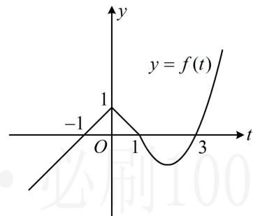
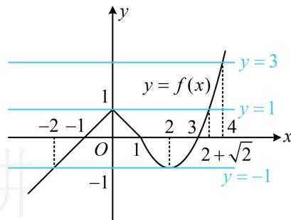
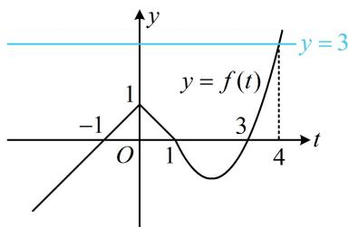

<!-- source-part:1 pages:1-2 -->

# 第2节 复合函数不等式问题（★★★）

内容提要

含有 $f(f(x))$ ， $f(g(x))$ 这类结构的不等式称为复合函数不等式，类似于上一节，复合函数不等式问题依然首选换元法求解，将内层的函数整体换元成 $t$ ，将一个双层的不等式问题化归成两个单层的不等式问题来处理.

【例题】设函数 $f(x)=\left\{\begin{aligned}&1-\left|x\right|,x\leq1\\ &x^{2}-4x+3,x>1\end{aligned}\right.$ ，若 $f(f(x))\geq0$ ，则实数 x 的取值范围为（）

A. $[-2,2]$ B. $[-2,2+\sqrt{2}]\cup[4,+\infty)$ C. $[-2,2+\sqrt{2}]$ D. $[-2,2]\cup[4,+\infty)$

解析：看到复合结构的不等式 $f(f(x)) \geq 0$ ，想到将内层的 $f(x)$ 换元成 $t$ ，化整为零，

设 $t = f(x)$ ，则 $f(f(x)) \geq 0$ 即为 $f(t) \geq 0$ ，函数 $y = f(t)$ 的图象好画，故直接画图来看 $f(t) \geq 0$ 的解，函数 $y = f(t)$ 的大致图象如图1，由图可知 $f(t) \geq 0 \Leftrightarrow -1 \leq t \leq 1$ 或 $t \geq 3$ ，所以 $-1 \leq f(x) \leq 1$ 或 $f(x) \geq 3$ ，函数 $y = f(x)$ 的大致图象如图2，要求解上述不等式，先求出 $y = 1$ 和 $y = 3$ 与该图象交点的横坐标，

$\left\{ \begin{array}{l} y = 1 \\ y = x^{2} - 4x + 3 \end{array} \right. \Rightarrow x = 2 + \sqrt{2}$ 或 $2 - \sqrt{2}$ , $\left\{ \begin{array}{l} y = 3 \\ y = x^{2} - 4x + 3 \end{array} \right. \Rightarrow x = 4$ 或 $0$ ,

由图可知直线 $y = 1$ 和 $y = 3$ 与 $y = f(x)$ 的图象的交点的横坐标分别为 $2 + \sqrt{2}$ 和4，所以不等式 $-1\leq f(x)\leq 1$ 的解为 $-2\leq x\leq$ $2 + \sqrt{2}$ ，不等式 $f(x)\geq 3$ 的解集为 $x\geq 4$ 故实数 $x$ 的取值范围为 $[-2,2 + \sqrt{2} ]\cup [4, + \infty)$

  
图1  
图2

答案: B

【变式】设函数 $f(x)=\left\{\begin{aligned}&1-\left|x\right|,x\leq1\\ &x^{2}-4x+3,x>1\end{aligned}\right.$ ， $g(x)=4^{x}-a\cdot2^{x}+4(a\in\mathbf{R})$ ，若 $f(g(x))\geq3$ 对任意的 $x\in\mathbf{R}$ 恒成立，则 a 的取值范围为 \_\_\_\_.

解析：看到复合结构 $f(g(x))$ ，先将内层的 $g(x)$ 换元，设 $t = g(x)$ ，则 $f(g(x))\geq 3$ 即为 $f(t)\geq 3$ 直线 $y = 3$ 和函数 $y = f(t)$ 的图象如图， $\left\{ \begin{array}{l}y = 3\\ y = t^2 -4t + 3 \end{array} \right.\Rightarrow t = 4$ 或0，由图可知 $f(t)\geq 3\Leftrightarrow t\geq 4$ ，所以问题等价于 $g(x)\geq 4$ 恒成立，即 $4^{x} - a\cdot 2^{x} + 4\geq 4$ ，化简得： $2^{x} - a\geq 0$ ，故 $a\leq 2^{x}$ 恒成立，因为 $2^{x}\in (0, + \infty)$ ，所以 $a\leq 0$

答案: $(- \infty, 0]$

【反思】处理复合结构的不等式，关键技巧是将内层换元，转化为两个简单结构的不等式来分析.

![[高中/总复习/教辅/一数常规版2026/第3章 函数与导数/模块6：复合函数综合/第2节 复合函数不等式问题/强化训练/强化训练.md]]
